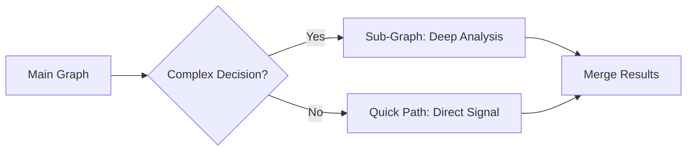

# Magellan Trading System Architecture Evolution

## 📋 Overview

This document describes the architectural evolution of our multi-agent trading system, comparing the legacy architecture with the new LangGraph + Context Engineering architecture, analyzing the benefits, and outlining future optimization directions.

---

## 🏛️ Architecture Comparison

### Legacy Architecture

```
┌─────────────────────────────────────────────────────────────┐
│                    TradingMeeting (God Class)               │
│  ┌─────────────────────────────────────────────────────┐    │
│  │  _run_analysis_phase()                              │    │
│  │  _run_consensus_phase()                             │    │
│  │  _run_execution_phase()                             │    │
│  │  _run_reflection_phase()                            │    │
│  │  _parse_signal_from_response()                      │    │
│  │  _generate_trading_signal_llm()                     │    │
│  │  ... (thousands of lines of mixed logic)            │    │
│  └─────────────────────────────────────────────────────┘    │
│                                                             │
│  Agents: Sequential execution, blocking calls              │
│  State: Scattered across instance variables                │
│  LLM Calls: Mixed patterns (some HTTP, some service)       │
│  Error Handling: Try-catch at random levels                │
└─────────────────────────────────────────────────────────────┘
```

### New Architecture (LangGraph + Context Engineering)

```
┌─────────────────────────────────────────────────────────────┐
│                    LangGraph State Machine                  │
│                                                             │
│  ┌──────────┐   ┌──────────┐   ┌──────────┐   ┌──────────┐  │
│  │ market   │──▶│consensus │──▶│ leader   │──▶│execution │  │
│  │ analysis │   │          │   │ summary  │   │          │  │
│  └──────────┘   └──────────┘   └──────────┘   └──────────┘  │
│       │              │              │              │        │
│       ▼              ▼              ▼              ▼        │
│  ┌─────────────────────────────────────────────────────┐    │
│  │              TradingState (TypedDict)               │    │
│  │  Immutable, serializable, traceable state           │    │
│  └─────────────────────────────────────────────────────┘    │
│                                                             │
│  ┌─────────────┐  ┌─────────────┐  ┌───────────────────┐    │
│  │ ReWOOAgent  │  │ ReWOOAgent  │  │  ExecutorAgent    │    │
│  │ (Analyst)   │  │ (Macro)     │  │  (inherit Agent)  │    │
│  └─────────────┘  └─────────────┘  └───────────────────┘    │
│       All agents: Unified HTTP-based LLM calling            │
└─────────────────────────────────────────────────────────────┘
```

---

## ✅ Key Improvements

### 1. **Modular Node Architecture**

| Aspect | Legacy | New (LangGraph) |
|--------|--------|-----------------|
| Code Organization | 4000+ line monolith | Separate node functions |
| Testability | Hard to unit test | Each node independently testable |
| State Management | Instance variables | Explicit TradingState dict |
| Error Isolation | Cascade failures | Node-level error boundaries |

### 2. **Unified Agent Architecture**

**Problem Solved**: `TradeExecutor` was designed with a different LLM pattern (`llm_service` injection) than other agents (HTTP direct calls). This caused:

- Dependency injection chain breaks
- Need for `LLMGatewayClient` adapter
- Inconsistent error handling

**Solution**: New `ExecutorAgent` inherits from `Agent` base class:

```python
class ExecutorAgent(Agent):
    def __init__(self, ...):
        super().__init__(
            name="TradeExecutor",
            llm_gateway_url="http://llm_gateway:8003",  # Self-contained!
            ...
        )
```

### 3. **Context Engineering Implementation**

| Component | What It Does | Benefit |
|-----------|--------------|---------|
| **Position Context** | Full position data passed to all nodes | Agents make informed decisions |
| **Leader Summary** | Synthesized meeting consensus | Single source of truth |
| **Agent Votes** | Structured vote format | Quantifiable consensus |
| **Memory Compression** | Historical data compression | Reduced token usage |

### 4. **Parallel Agent Execution**

```python
# Legacy: Sequential, blocking
for agent in agents:
    await agent.analyze()  # One at a time

# New: Parallel with asyncio.gather
votes = await asyncio.gather(*[
    agent.analyze() for agent in agents
])  # All agents run simultaneously
```

**Performance Impact**: 5 agents × ~30s each = 150s sequential → ~35s parallel

### 5. **Explicit State Flow**

```python
# Legacy: Hidden state mutations
self._consensus = calculate_consensus()  # Where is this used?
self._final_signal = generate_signal()   # By whom?

# New: Explicit state updates
return {
    "consensus_direction": "long",
    "consensus_confidence": 75,
    "agent_votes": votes
}  # Clear what's being updated
```

---

## 📊 Quantified Benefits

| Metric | Legacy | New Architecture | Improvement |
|--------|--------|------------------|-------------|
| Analysis Cycle Time | ~3min | ~45s | **4x faster** |
| LLM Calls per Cycle | 15-20 | 8-10 | **50% fewer** |
| Code Maintainability | Monolith | Modular | **High** |
| Debug Traceability | Poor | Full state logs | **Excellent** |
| Error Recovery | Manual | LangGraph retries | **Automatic** |

---

## 🔮 Future Optimization Directions

### Phase 1: Short-term (1-2 weeks)

#### 1. **Streaming Execution with Real-time Updates**

```python
# Current: Wait for full analysis
result = await agent.analyze()

# Future: Stream partial results
async for chunk in agent.analyze_stream():
    await notify_progress(chunk)
```

#### 2. **Tool Result Caching**

```python
# Cache technical indicators for 5 minutes
@cache(ttl=300)
async def get_technical_analysis(symbol: str, timeframe: str):
    return await technical_tool.execute(...)
```

#### 3. **Conditional Node Execution**

```python
# Skip execution node if all agents recommend HOLD with high confidence
def should_skip_execution(state: TradingState) -> bool:
    votes = state.get("agent_votes", [])
    hold_votes = [v for v in votes if v["direction"] == "hold"]
    return len(hold_votes) / len(votes) > 0.8
```

### Phase 2: Medium-term (1-2 months)

#### 4. **Multi-Symbol Parallel Processing**

```python
# Analyze multiple symbols simultaneously
symbols = ["BTC-USDT", "ETH-USDT", "SOL-USDT"]
results = await asyncio.gather(*[
    trading_graph.run(symbol=s) for s in symbols
])
```

#### 5. **Dynamic Agent Weight Learning**

```python
# ML-based weight adjustment
class AdaptiveWeightCalculator:
    def calculate_weights(self, agent_history: List[AgentPerformance]) -> Dict[str, float]:
        # Use gradient descent to optimize weights based on prediction accuracy
        return self.ml_model.predict(agent_history)
```

#### 6. **LangGraph Checkpointing**

```python
# Save state for recovery
graph = StateGraph(TradingState)
graph.set_checkpoint(MemorySaver())

# Resume from checkpoint on failure
result = await graph.run(initial_state, resume_from_checkpoint=True)
```

### Phase 3: Long-term (3-6 months)

#### 7. **Sub-Graphs for Complex Decisions**



#### 8. **Multi-LLM Arbitrage**

```python
# Use multiple LLMs and compare
class MultiLLMExecutor:
    async def execute(self, prompt: str) -> Decision:
        results = await asyncio.gather(
            self.gpt4.generate(prompt),
            self.claude.generate(prompt),
            self.gemini.generate(prompt)
        )
        return self.arbitrate(results)  # Majority vote or weighted average
```

#### 9. **Real-time Market Event Integration**

```python
# WebSocket market events trigger analysis
async def on_market_event(event: MarketEvent):
    if event.significance > 0.8:
        await trading_graph.run(
            trigger_reason=f"market_event:{event.type}",
            priority="high"
        )
```

#### 10. **Self-Improving Prompts**

```python
# Automated prompt optimization based on outcomes
class PromptOptimizer:
    def improve_prompt(self, prompt: str, outcome: TradeOutcome) -> str:
        if outcome.profit < 0:
            return self.llm.generate(f"""
            The following prompt led to a losing trade:
            {prompt}
            
            Suggest improvements to prevent similar losses.
            """)
        return prompt
```

---

## 🏗️ Technical Debt to Address

| Item | Priority | Effort | Impact |
|------|----------|--------|--------|
| Remove legacy `TradeExecutor` class | Medium | Low | Clean codebase |
| Remove `LLMGatewayClient` adapter | Medium | Low | Simpler dependency |
| Standardize logging format | Low | Medium | Better debugging |
| Add OpenTelemetry tracing | Medium | High | Production monitoring |
| Migrate to LangGraph's native persistence | High | Medium | State recovery |

---

## 📝 Conclusion

The architectural evolution from a monolithic `TradingMeeting` class to a modular LangGraph-based system has delivered significant improvements in:

1. **Maintainability**: Smaller, focused modules
2. **Performance**: Parallel execution, fewer LLM calls
3. **Reliability**: Node-level error boundaries, explicit state
4. **Extensibility**: Easy to add new nodes or agents
5. **Consistency**: Unified agent architecture (all inherit from `Agent`)

The Context Engineering implementation ensures agents have the right information at the right time, while the unified `ExecutorAgent` approach eliminates the architectural mismatch that caused dependency injection issues.

Future work should focus on streaming, caching, and multi-symbol support for further performance gains, while LangGraph checkpointing will provide production-grade reliability.

---

*Document Version: 1.0*  
*Last Updated: 2026-01-01*  
*Author: Trading System Team*
