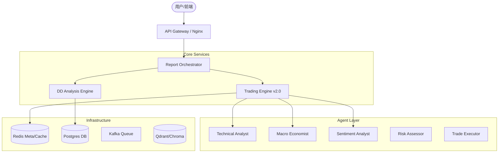

# Magellan AI 投资分析与量化交易平台文档

**版本**: v2.0 (Refactored)  
**更新日期**: 2025-12-30  
**状态**: 正式发布

---

## 📋 目录

1. [项目概述](#1-项目概述)
2. [核心价值与能力](#2-核心价值与能力)
3. [v2.0 系统架构](#3-v20-系统架构)
4. [两大核心引擎](#4-两大核心引擎)
    * [4.1 DD 尽调分析引擎](#41-dd-尽调分析引擎)
    * [4.2 量化交易引擎 (v2.0)](#42-量化交易引擎-v20)
5. [Agent 智能体系统](#5-agent-智能体系统)
6. [技术栈与基础设施](#6-技术栈与基础设施)
7. [部署与运维](#7-部署与运维)
8. [API 参考](#8-api-参考)

---

## 1. 项目概述

**Magellan AI** 是一个企业级智能投资分析平台，融合了 **深度尽职调查 (Due Diligence)** 与 **自动化量化交易** 两大核心能力。平台利用最先进的大语言模型 (LLM) 技术，构建了一个由多个专家 Agent 组成的"虚拟分析师团队"，能够像人类专业团队一样进行多维度的市场分析、风险评估和交易决策。

在 **v2.0 版本** 中，系统完成了重大重构，引入了 **LangGraph** 编排、**Reflexion** 反思机制、**ReAct** 回退执行和统一的 **SafetyGuard** 安全体系，显著提升了系统的稳定性、决策质量和自我进化能力。

### 核心定位

* **面向机构**: 自动化生成机构级深度的投研报告 (PDF/Markdown)。
* **面向交易**: 7x24小时全自动量化交易，支持多策略融合与风险控制。
* **面向开发者**: 模块化、可扩展的 Agent 框架，易于集成新策略。

---

## 2. 核心价值与能力

### 🛡️ 智能风控 (Safety First)

* **多层级防护**: 所有的交易指令必须通过 **SafetyGuard** 的严格审查。
* **全面检查**: 包括开机保护、日亏损熔断、Cooldown 冷却期、OKX 对冲模式检查、参数合理性校验。
* **并发锁**: 确保高频环境下的数据一致性和资金安全。

### 🧠 自我进化 (Self-Correction)

* **Reflexion 引擎**: 每次交易结束后，系统会自动进行"复盘"。
* **动态权重**: 根据历史表现自动调整各 Agent 的投票权重（表现好+5%，表现差-3%）。
* **经验库**: 失败教训被写入长期记忆 (Redis)，防止重蹈覆辙。

### ⚙️ 灵活编排 (Orchestration)

* **LangGraph 工作流**: 交易流程被建模为有向无环图 (DAG)，状态流转清晰可见。
* **ReAct 回退**: 当 LLM 执行工具失败时，自动进入 ReAct 思考模式尝试修复，最大重试 3 次。
* **时间感知**: 所有分析强制注入 UTC+8 精确时间，杜绝"幻觉"引用过时数据。

---

## 3. v2.0 系统架构

系统采用微服务架构，核心由 **Report Orchestrator** 驱动，并通过 **Gateway** 统一对外服务。

### 3.1 顶层架构图



### 3.2 目录结构

```
magellan/
├── backend/services/report_orchestrator/   # 核心服务
│   ├── app/core/trading/
│   │   ├── orchestration/    # LangGraph 编排 (v2.0)
│   │   ├── reflection/       # 反思引擎 (v2.0)
│   │   ├── safety/           # 安全守卫 (v2.0)
│   │   ├── executor.py       # 交易执行器
│   │   └── agents/           # Agent 定义
│   └── ...
├── frontend/                 # Vue 3 前端
├── trading-standalone/       # 轻量级独立部署包
└── docs/                     # 文档资源
```

---

## 4. 两大核心引擎

### 4.1 DD 尽调分析引擎

专注于一级/二级市场深度研究，生成长篇研报。

* **5大场景**: Early Stage, Growth, Public Market, Alternative, Industry Research。
* **ReWOO 架构**: Plan -> Work -> Orchestrate，适合处理复杂长流程任务。
* **多模态输出**: 支持生成 Markdown、PDF 以及 Excel 财务模型。

*(此处保持 v1.0 逻辑稳定，未做破坏性变更)*

### 4.2 量化交易引擎 (v2.0) 👑

**这是 v2.0 重构的核心部分**。不再使用线性的脚本流程，而是基于 **LangGraph** 的状态机流转。

#### 4.2.1 工作流节点

1. **Market Analysis Node**: 4个分析 Agent (技术/宏观/情绪/量化) 并行工作，生成市场观点。
2. **Signal Generation Node**: 收集各 Agent 投票 (Long/Short/Hold) 及置信度。
3. **Risk Assessment Node**: 风险官 (RiskAssessor) 独立评估，计算 VaR，检查杠杆率。
4. **Consensus Node Leader**: 汇总意见，生成最终 Signal。
5. **Execution Node**:
    * **SafetyGuard** 预检
    * **TradeExecutor** 执行 (支持 ReAct 回退)
6. **Reflection Node**: (异步) 交易结束后触发反思，更新记忆权重。

#### 4.2.2 状态管理 (Unified State)

系统维护一个全局 `TradingState`，在各节点间传递：

```python
class TradingState(TypedDict):
    trigger_reason: str          # 触发原因
    market_data: Dict            # 原始行情
    analysis_results: Dict       # 各Agent分析结果
    agent_votes: List[AgentVote] # 投票集合
    risk_assessment: Dict        # 风险评估结果
    consensus: TradingSignal     # 最终共识
    execution_result: Dict       # 执行结果
    reflection: Dict             # 反思记录
```

---

## 5. Agent 智能体系统

### 5.1 角色矩阵

| Agent | 职责 | v2.0 增强特性 |
|-------|------|--------------|
| **TechnicalAnalyst** | K线/指标分析 | 内置 RSI/MACD/BB 计算工具 |
| **MacroEconomist** | 宏观/新闻分析 | **Time-Awareness** 强制时间感知 |
| **SentimentAnalyst** | 情绪/舆情分析 | FGI 指数与资金费率结合 |
| **QuantStrategist** | 统计套利分析 | 波动率与动量追踪 |
| **RiskAssessor** | 独立风控 | 不参与投票，拥有 **一票否决权** |
| **TradeExecutor** | 交易执行 | **ReAct Fallback** 自动纠错能力 |
| **ReflectionEngine** | 学习与反思 | **Redis Memory** 长期记忆存储 |

### 5.2 交易执行器 (TradeExecutor)

独立的执行模块，负责将自然语言决策转化为交易所 API 调用。

* **工具调用 (Function Calling)**: 原生支持 OpenAI 格式工具调用。
* **安全解析**: 对 LLM 输出进行严格正则校验。
* **ReAct 模式**:
    > *思考*: 订单因余额不足失败。
    > *行动*: 查询当前余额。
    > *观察*: 余额为 500 USDT。
    > *思考*: 重新计算仓位大小。
    > *行动*: 下单 450 USDT。

### 5.3 反思引擎 (ReflectionEngine)

实现了 **Reflexion** 模式：

1. **Trigger**: 仓位平仓 (TP/SL/Manual)。
2. **Analyze**: 对比 `Entry Reason` (入场理由) 与 `Exit Result` (最终结果)。
3. **Learn**: 识别哪些 Agent 预测正确，哪些错误。
4. **Adjust**:
    * 正确 Agent 权重 **+5%** (Max 2.0)
    * 错误 Agent 权重 **-3%** (Min 0.5)

---

## 6. 技术栈与基础设施

| 层级 | 技术组件 | 说明 |
|------|---------|------|
| **Language** | Python 3.11+ | 全面异步 (AsyncIO) |
| **Web Framework** | FastAPI | 高性能 API 服务 |
| **Orchestration** | **LangGraph** | (v2.0 新增) 状态机编排 |
| **LLM Gateway** | LangChain / Custom | 支持 Google Gemini, OpenAI, Claude |
| **Database** | PostgreSQL | 业务数据持久化 |
| **Cache/Memory** | **Redis** | (v2.0 关键) 会话状态、反思记忆、分布式锁 |
| **Vector DB** | Qdrant | RAG 知识库检索 |
| **Frontend** | Vue 3 + Vite | 现代化实时仪表盘 |
| **Container** | Docker Compose | 一键编排部署 |

---

## 7. 部署与运维

### 7.1 环境要求

* Unbuntu 22.04+ (推荐)
* Docker & Docker Compose
* CPU: 2 Core+, RAM: 4GB+ (Standalone模式)

### 7.2 快速启动 (Standalone 模式)

适合专注于量化交易的场景，资源占用极低。

```bash
# 1. 克隆代码
git clone https://github.com/dengjianbo3/Magellan.git
cd Magellan/trading-standalone

# 2. 配置环境变量
cp ../.env.example .env
vim .env  # 填入 OKX_API_KEY, GOOGLE_API_KEY 等

# 3. 启动服务 (v2.0 需要 --build 参数构建新依赖)
./start.sh

# 4. 查看状态
./status.sh
```

### 7.3 验证部署

访问 Dashboard: `http://localhost:8888`

或者通过命令行检查：

```bash
# 检查交易服务日志，确认 LangGraph 初始化
docker compose logs trading_service | grep "TradingGraph"

# 检查 Redis 连接
docker compose logs trading_service | grep "Redis"
```

---

## 8. API 参考

### 8.1 交易控制

* **GET** `/api/trading/status`: 获取当前系统状态（仓位、余额、调度器状态）。
* **POST** `/api/trading/start`: 启动自动交易调度器。
* **POST** `/api/trading/stop`: 停止自动交易。
* **POST** `/api/trading/trigger`: 手动触发一次完整分析流程。

### 8.2 仓位管理

* **GET** `/api/trading/position`: 获取当前持仓详情。
* **POST** `/api/trading/close`: 强行市价平仓。

### 8.3 历史数据

* **GET** `/api/trading/history`: 获取交易历史记录 (Reflexion 数据)。
* **GET** `/api/trading/equity`: 获取权益曲线数据。

---

*Magellan Project - Designed for the Future of Intelligent Trading.*
