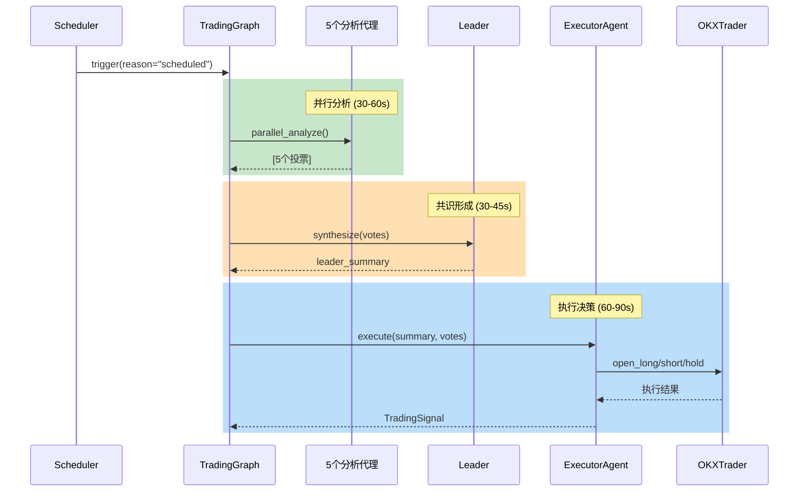
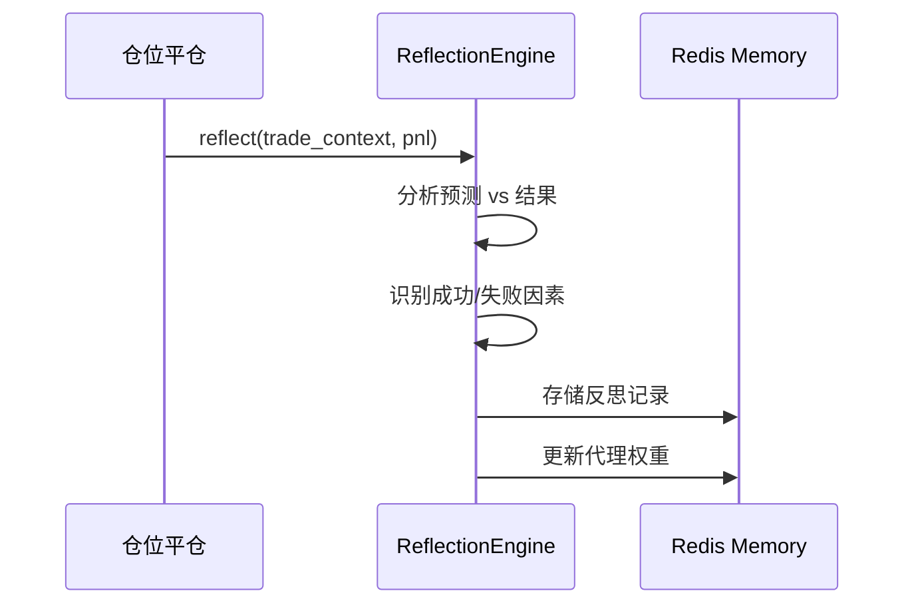

# Magellan 多智能体交易系统 - 技术文档

## 📋 项目概述

Magellan 是一个基于 **LangGraph + Context Engineering** 架构的多智能体自动化加密货币交易系统。系统通过多个专业化 AI 代理（Agent）进行市场分析，然后由协调层综合各方意见，最终做出交易决策并执行。

### 核心特性

- 🤖 **多智能体协作**：5个专业分析代理 + 1个执行代理
- 🔄 **LangGraph 工作流**：模块化的状态机架构，支持条件分支和错误恢复
- 📊 **ReWOO 模式**：规划→执行→综合，减少 LLM 调用次数
- ⚡ **并行执行**：代理分析并行运行，显著提升效率
- 🛡️ **安全控制**：多层安全检查，止盈止损自动设置
- 🧠 **反思学习**：从交易结果学习，动态调整代理权重

---

## 🏗️ 系统架构

### 整体架构图

```
┌─────────────────────────────────────────────────────────────────────────────┐
│                         Magellan Trading System v2.0                         │
├─────────────────────────────────────────────────────────────────────────────┤
│                                                                              │
│  ┌─────────────────────────────────────────────────────────────────────┐    │
│  │                      Orchestration Layer (编排层)                   │    │
│  │                                                                     │    │
│  │  ┌─────────────────┐  ┌─────────────────┐  ┌─────────────────┐     │    │
│  │  │    Scheduler    │──│  TradingGraph   │──│  TradingState   │     │    │
│  │  │    (调度器)     │  │   (LangGraph)   │  │   (状态管理)    │     │    │
│  │  └─────────────────┘  └─────────────────┘  └─────────────────┘     │    │
│  └─────────────────────────────────────────────────────────────────────┘    │
│                                     │                                        │
│                                     ▼                                        │
│  ┌─────────────────────────────────────────────────────────────────────┐    │
│  │                         Agent Layer (代理层)                         │    │
│  │                                                                     │    │
│  │  ┌─────────────────────────────────────────────────────────────┐   │    │
│  │  │              Analysis Agents (分析代理)                      │   │    │
│  │  │  ┌──────────┐ ┌──────────┐ ┌──────────┐ ┌──────────┐       │   │    │
│  │  │  │Technical │ │  Macro   │ │Sentiment │ │ On-chain │       │   │    │
│  │  │  │ Analyst  │ │Economist │ │ Analyst  │ │ Analyst  │       │   │    │
│  │  │  └──────────┘ └──────────┘ └──────────┘ └──────────┘       │   │    │
│  │  │  ┌──────────┐ ┌─────────────────────────────────────┐       │   │    │
│  │  │  │  Quant   │ │           Leader Agent              │       │   │    │
│  │  │  │Strategist│ │         (总结 + 共识)                │       │   │    │
│  │  │  └──────────┘ └─────────────────────────────────────┘       │   │    │
│  │  └─────────────────────────────────────────────────────────────┘   │    │
│  │  ┌──────────────┐ ┌──────────────┐ ┌──────────────────────┐        │    │
│  │  │ExecutorAgent │ │ SafetyGuard  │ │  ReflectionEngine    │        │    │
│  │  │  (交易执行)   │ │  (安全检查)  │ │    (反思学习)        │        │    │
│  │  └──────────────┘ └──────────────┘ └──────────────────────┘        │    │
│  └─────────────────────────────────────────────────────────────────────┘    │
│                                     │                                        │
│                                     ▼                                        │
│  ┌─────────────────────────────────────────────────────────────────────┐    │
│  │                      Execution Layer (执行层)                        │    │
│  │                                                                     │    │
│  │  ┌──────────────────────────┐    ┌──────────────────────────┐      │    │
│  │  │      PaperTrader         │    │       OKXTrader          │      │    │
│  │  │     (模拟交易)           │    │    (OKX 实盘/模拟)       │      │    │
│  │  └──────────────────────────┘    └──────────────────────────┘      │    │
│  └─────────────────────────────────────────────────────────────────────┘    │
│                                     │                                        │
│                                     ▼                                        │
│  ┌─────────────────────────────────────────────────────────────────────┐    │
│  │                        Memory Layer (记忆层)                         │    │
│  │                                                                     │    │
│  │  ┌──────────────────┐ ┌──────────────────┐ ┌──────────────────┐    │    │
│  │  │  Agent Memory    │ │  Trade History   │ │ Reflection Store │    │    │
│  │  │   (代理记忆)      │ │   (交易历史)     │ │    (反思存储)    │    │    │
│  │  └──────────────────┘ └──────────────────┘ └──────────────────┘    │    │
│  │                      全部基于 Redis 存储                            │    │
│  └─────────────────────────────────────────────────────────────────────┘    │
│                                                                              │
└─────────────────────────────────────────────────────────────────────────────┘
```

### LangGraph 工作流

```
┌─────────────────┐
│ market_analysis │ ← 收集市场数据、计算技术指标
└────────┬────────┘
         ↓
┌─────────────────┐
│signal_generation│ ← 5个分析代理并行分析，生成投票
└────────┬────────┘
         ↓
┌─────────────────┐
│ risk_assessment │ ← 评估风险、检查安全限制
└────────┬────────┘
         ↓
┌─────────────────┐
│    consensus    │ ← Leader 综合投票形成共识
└────────┬────────┘
         ↓
    ┌────┴────┐
    │  check  │
    └────┬────┘
    ↓ 成功    ↓ 错误
┌──────────┐  ┌───────────────┐
│ execution│  │ react_fallback│ ← ReAct 模式错误恢复
└────┬─────┘  └───────┬───────┘
     ↓                ↓
  ┌──┴──┐           END
  │check│
  └──┬──┘
  ↓ 交易  ↓ 持有
┌──────────┐  │
│reflection│  │ ← 从交易结果学习
└────┬─────┘  │
     ↓        ↓
    END      END
```

---

## 📊 智能体详解

### 1. 分析代理 (Analysis Agents)

所有分析代理都继承自 `ReWOOAgent`，采用 **Plan → Execute → Solve** 三阶段工作流：

| 代理 | 职责 | 工具 | 分析维度 |
|------|------|------|----------|
| **TechnicalAnalyst** | 技术面分析 | K线、指标计算 | RSI、MACD、EMA、趋势 |
| **MacroEconomist** | 宏观经济分析 | 新闻搜索、ETF流向 | 美联储政策、通胀、监管 |
| **SentimentAnalyst** | 市场情绪分析 | 恐惧贪婪指数、社媒 | FGI、资金费率、社区情绪 |
| **OnchainAnalyst** | 链上数据分析 | 交易所流入/流出 | 巨鲸动向、DeFi TVL |
| **QuantStrategist** | 量化策略分析 | 历史数据分析 | 动量、波动率、夏普比 |

### 2. Leader Agent

负责综合所有分析代理的投票，生成统一的市场判断：

- **输入**：5个代理的分析报告和投票
- **输出**：
  - 综合市场判断
  - 风险评估
  - 推荐的止盈/止损参数
  - 最终行动建议（多/空/持有/平仓）

### 3. ExecutorAgent (执行代理)

继承自 `ReWOOAgent`，负责执行最终交易决策：

```python
class ExecutorAgent(ReWOOAgent):
    """
    交易执行代理 - 使用与分析代理相同的 ReWOO 模式
    
    注册工具:
    - open_long: 开多仓
    - open_short: 开空仓  
    - hold: 持有不动
    - close_position: 平仓
    """
```

**工作流程**：

1. 接收 Leader 总结和代理投票
2. Plan 阶段决定调用哪个工具
3. Execute 阶段执行工具
4. Solve 阶段生成 TradingSignal

---

## 🔄 ReWOO 三阶段模式

ReWOO (Reasoning WithOut Observation) 是一种高效的 Agent 架构：

```
┌─────────────────────────────────────────────────────────────────┐
│                     ReWOO 三阶段执行                            │
├─────────────────────────────────────────────────────────────────┤
│                                                                 │
│  ┌─────────┐     ┌─────────┐     ┌─────────┐                   │
│  │  Plan   │ ──▶ │ Execute │ ──▶ │  Solve  │                   │
│  │ (规划)  │     │ (执行)  │     │ (综合)  │                   │
│  └─────────┘     └─────────┘     └─────────┘                   │
│      │               │               │                          │
│      ▼               ▼               ▼                          │
│  LLM 生成          并行执行        LLM 综合                      │
│  工具调用计划      所有工具调用    所有结果                       │
│                                                                 │
│  优势:                                                          │
│  - 减少 LLM 调用次数 (vs ReAct 的多次循环)                       │
│  - 工具并行执行，提升效率                                        │
│  - 更结构化的推理过程                                            │
│                                                                 │
└─────────────────────────────────────────────────────────────────┘
```

### 与 ReAct 对比

| 特性 | ReAct | ReWOO |
|------|-------|-------|
| LLM 调用次数 | 多次 (Think-Act-Observe 循环) | 2-3次 (Plan + Solve) |
| 工具执行 | 串行 | **并行** |
| 适用场景 | 需要交互反馈的任务 | 批量数据获取任务 |
| 使用位置 | 错误恢复 (react_fallback) | 正常分析流程 |

---

## 🛡️ 安全控制

### SafetyGuard 安全守卫

```python
class SafetyGuard:
    """交易安全守卫 - 多层安全检查"""
    
    检查项:
    - 并发执行锁: 防止同时执行多个交易
    - Startup 保护: 启动时不自动反转现有仓位
    - 日亏损限制: 超过每日亏损限额则停止交易
    - Cooldown 冷却: 连续亏损后强制冷却期
    - OKX 对冲模式: 检查是否启用了对冲模式
    - 参数验证: 杠杆、金额、TP/SL 合理性
```

### 止盈止损机制

开仓时自动设置 OKX Algo 订单：

```python
# 开仓同时设置 TP/SL
await self._set_tp_sl(
    symbol="BTC-USDT-SWAP",
    pos_side="long",
    tp_price=95000.0,  # 止盈价
    sl_price=86000.0   # 止损价
)
```

**Algo 订单特性**：

- OKX 交易所自动监控触发
- 7×24 小时生效，无需系统在线
- 触发后自动市价平仓

---

## 📈 数据信息流

### 正常分析流程



### 反思学习流程



---

## 🔧 技术栈

### 后端服务

| 组件 | 技术 | 用途 |
|------|------|------|
| 主服务 | FastAPI + Python 3.11 | API 和业务逻辑 |
| LLM 网关 | FastAPI | 统一 LLM 调用接口 |
| 工作流 | LangGraph | 状态机编排 |
| 缓存/存储 | Redis | 状态、历史、记忆 |
| 容器化 | Docker Compose | 服务编排 |

### LLM 模型

- **分析代理**: DeepSeek-Reasoner (思考模型)
- **Leader**: DeepSeek-Reasoner
- **ExecutorAgent**: GPT-4 / DeepSeek (非思考模型更适合 Tool Calling)

### 交易接口

| 交易所 | 模式 | 功能 |
|--------|------|------|
| OKX | Demo/Live | 真实 API 交易 |
| Paper | 模拟 | 本地模拟交易 |

---

## 📁 项目结构

```
backend/services/report_orchestrator/app/core/trading/
├── orchestration/              # LangGraph 编排
│   ├── graph.py               # TradingGraph 主类
│   ├── nodes.py               # 7个工作流节点
│   └── state.py               # TradingState 定义
│
├── executor_agent.py          # ExecutorAgent (ReWOOAgent)
├── executor.py                # TradeExecutor (旧版，保留兼容)
│
├── trading_meeting.py         # TradingMeeting 主入口
├── trading_agents.py          # 5个分析代理配置
├── trading_tools.py           # 代理工具定义
│
├── safety/                    # 安全控制
│   └── guards.py             # SafetyGuard
│
├── reflection/                # 反思引擎
│   └── engine.py             # ReflectionEngine
│
├── okx_client.py             # OKX API 客户端
├── okx_trader.py             # OKX 交易执行器
├── paper_trader.py           # 模拟交易器
│
└── scheduler.py              # 定时调度器
```

---

## 📊 新老架构对比

### 架构对比

| 特性 | 老架构 (TradingMeeting) | 新架构 (LangGraph) |
|------|-------------------------|-------------------|
| 代码组织 | 4000+ 行单一类 | 模块化节点函数 |
| 状态管理 | 实例变量分散 | 显式 TradingState |
| 代理执行 | 串行阻塞 | **并行执行** |
| 错误处理 | try-catch 分散 | 节点级边界 |
| LLM 调用 | 混合模式 | **统一 HTTP** |
| 可测试性 | 难以单元测试 | 每个节点独立测试 |

### 性能对比

| 指标 | 老架构 | 新架构 | 提升 |
|------|--------|--------|------|
| 分析周期时间 | ~3分钟 | ~45秒 | **4x 更快** |
| LLM 调用次数 | 15-20次 | 8-10次 | **50% 更少** |
| 错误恢复 | 手动 | 自动重试 | **自动化** |
| 调试追踪 | 困难 | 完整状态日志 | **优秀** |

### ExecutorAgent 统一化

**问题**：旧版 `TradeExecutor` 使用 `llm_service` 注入模式，与其他代理（直接 HTTP 调用）不一致。

**解决方案**：新版 `ExecutorAgent` 继承 `ReWOOAgent`：

```python
# 旧版 (不一致)
class TradeExecutor:
    def __init__(self, llm_service, ...):  # 需要注入
        self.llm = llm_service

# 新版 (统一)
class ExecutorAgent(ReWOOAgent):
    def __init__(self, ...):
        super().__init__(
            llm_gateway_url="http://llm_gateway:8003"  # 自包含
        )
```

---

## 🚀 部署指南

### Docker Compose 部署

```bash
# 启动所有服务
cd trading-standalone
docker compose up -d

# 查看日志
docker logs -f trading-service

# 重新构建
docker compose build trading_service
docker compose up -d trading_service
```

### 服务端口

| 服务 | 端口 | 说明 |
|------|------|------|
| trading_service | 8002 | 交易主服务 |
| llm_gateway | 8003 | LLM 网关 |
| redis | 6379 | 缓存存储 |
| web_search | 内部 | 搜索服务 |

### 环境变量

```env
# OKX API
OKX_API_KEY=xxx
OKX_SECRET_KEY=xxx
OKX_PASSPHRASE=xxx
OKX_DEMO_MODE=true

# LLM
DEEPSEEK_API_KEY=xxx
OPENAI_API_KEY=xxx

# Redis
REDIS_URL=redis://redis:6379
```

---

## 🔮 未来优化方向

### 短期 (1-2周)

1. **流式执行**：实时显示分析进度
2. **工具结果缓存**：减少重复 API 调用
3. **条件节点执行**：高共识时跳过执行节点

### 中期 (1-2月)

1. **多币种并行**：同时分析 BTC/ETH/SOL
2. **动态权重学习**：ML 优化代理权重
3. **LangGraph 检查点**：故障恢复

### 长期 (3-6月)

1. **子图复杂决策**：分层分析
2. **多 LLM 仲裁**：GPT-4 + Claude + Gemini 投票
3. **实时事件触发**：WebSocket 市场事件驱动

---

## 📝 总结

Magellan 多智能体交易系统通过 LangGraph + Context Engineering 架构实现了：

1. ✅ **模块化**：从 4000+ 行单体类到可维护的独立模块
2. ✅ **高性能**：并行执行，分析时间减少 75%
3. ✅ **可靠性**：节点级错误边界，自动恢复
4. ✅ **一致性**：所有代理统一继承 ReWOOAgent
5. ✅ **安全性**：多层安全检查，自动止盈止损
6. ✅ **可扩展**：易于添加新代理或节点

系统已在 OKX Demo 环境稳定运行，支持 7×24 小时自动化交易。

---

*文档版本: 2.0*  
*最后更新: 2026-01-01*  
*维护团队: Magellan Trading Team*
