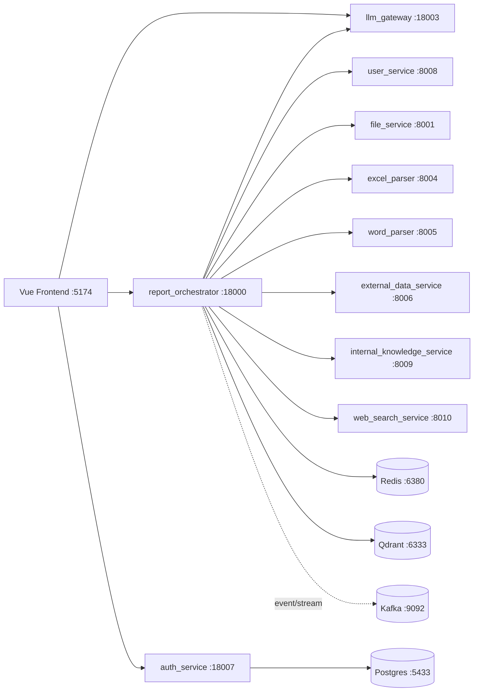
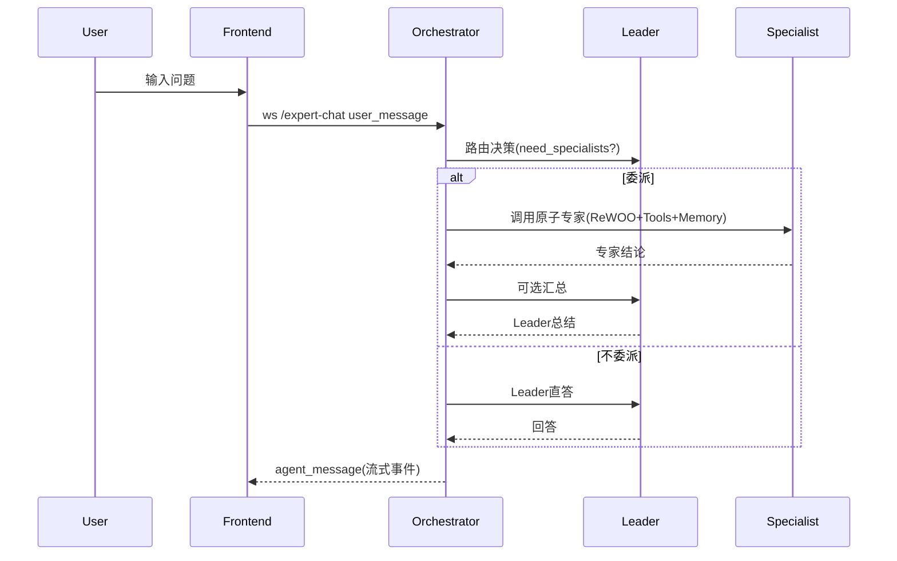
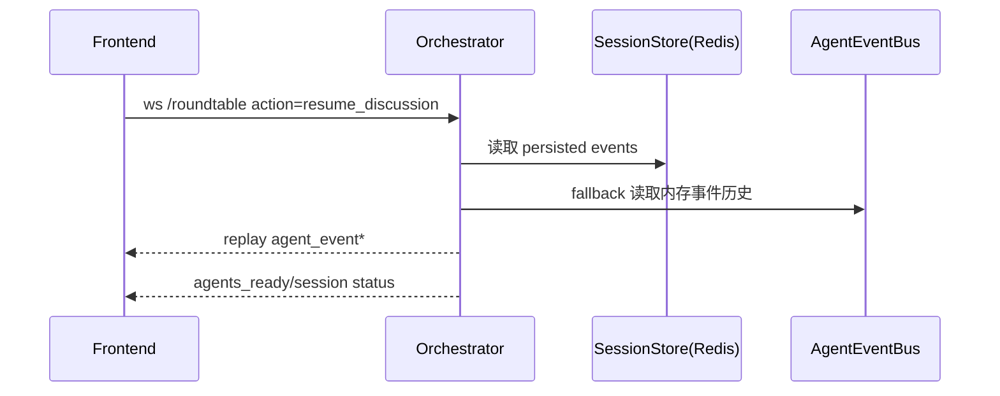

# Magellan 全量架构文档（基于当前代码）

**文档版本**: 2026-02-26  
**适用分支**: `dev`（当前工作区）  
**目标**: 以“原子 Agent 统一能力层”为核心，完整描述系统当前实现。

---

## 1. 架构总览

Magellan 当前是一个以 `report_orchestrator` 为核心编排层的多服务系统，覆盖以下产品能力：

1. 分析工作流（Analysis / DD）
2. 专家群聊（Expert Chat）
3. 头脑风暴（Roundtable）
4. 知识库（Knowledge / RAG）
5. 自动交易（Trading）
6. 认证与账户（Auth + User）

系统核心设计理念是：

1. 原子 Agent 是稳定能力单元（可复用）
2. 不同场景差异体现在“编排方式”，不是新增碎片化专家
3. 所有核心链路支持可观测（metrics/event/log）、可恢复（session/event persistence）、可扩展（YAML 配置驱动）

---

## 2. 部署与运行拓扑（Docker Compose）

### 2.1 服务拓扑

### 2.2 关键端口

| 服务 | 宿主端口 | 说明 |
|---|---:|---|
| frontend(vite) | 5174 | Web UI |
| report_orchestrator | 18000 | 核心编排 API + WS |
| llm_gateway | 18003 | 统一 LLM 接口 |
| auth_service | 18007 | 登录/注册/JWT |
| user_service | 8008 | 用户偏好 |
| file_service | 8001 | 文件上传 |
| excel_parser | 8004 | Excel 解析 |
| word_parser | 8005 | Word 解析 |
| external_data_service | 8006 | 外部公司数据 |
| internal_knowledge_service | 8009 | 知识代理服务 |
| web_search_service | 8010 | Web 搜索 |
| redis | 6380 | 会话/报告/事件存储 |
| qdrant | 6333/6334 | 向量检索 |
| postgres | 5433 | auth 数据库 |

---

## 3. 前端架构（Vue 3 + Pinia + Router）

### 3.1 页面结构

主路由在 `frontend/src/router/index.js`：

1. 公共页：`/login`、`/register`
2. 认证后页：`/`（ChatHub）、`/analysis`、`/roundtable`、`/knowledge`、`/reports`、`/settings`、`/trading`、`/agents`

### 3.2 鉴权机制

1. `auth` store (`frontend/src/stores/auth.js`) 管理 access/refresh token
2. 路由守卫在进入受保护页面前调用 `fetchCurrentUser()`
3. 失败时自动尝试 refresh；仍失败则回登录页

### 3.3 实时交互链路

1. Expert Chat：`ws://.../ws/expert-chat?token=...`
2. Roundtable：`ws://.../ws/roundtable?token=...`
3. Analysis V2：`/api/v2/analysis/start` + `ws/v2/analysis/{session_id}`

---

## 4. 后端总体架构（Orchestrator 为核心）

`backend/services/report_orchestrator/app/main.py` 是聚合入口，统一挂载：

1. REST routers（health/reports/agents/knowledge/roundtable/files/analysis/export/dd/trading 等）
2. WS endpoints（`/ws/expert-chat`、`/ws/roundtable`、`/ws/v2/analysis/{id}`）
3. 模型策略、编排模板、memory、skills、metrics

编排层职责：

1. 把业务场景转换为 agent 编排序列
2. 路由 LLM 与工具调用
3. 维持会话与历史
4. 实时事件推送到前端

---

## 5. 原子 Agent 架构（核心）

### 5.1 配置驱动注册

1. 注册表：`app/core/agent_registry.py`
2. 配置文件：`backend/services/report_orchestrator/config/agents.yaml`
3. workflow 编排：`backend/services/report_orchestrator/config/workflows.yaml`

`AgentRegistry` 会：

1. 读取 `agents.yaml` 和 `workflows.yaml`
2. 通过 `class_path` 动态创建 agent
3. 按 `type/scope/tags` 过滤候选 agent

### 5.2 当前 Agent 分层

`agents.yaml` 当前定义：

1. Atomic：
`bp_parser`、`team_evaluator`、`market_analyst`、`financial_expert`、`risk_assessor`、`tech_specialist`、`legal_advisor`、`technical_analyst`、`macro_economist`、`esg_analyst`、`sentiment_analyst`、`quant_strategist`、`deal_structurer`、`ma_advisor`、`onchain_analyst`、`contrarian_analyst`
2. Special：
`leader`（roundtable 主持）、
`report_synthesizer`（analysis 报告综合）

### 5.3 实现层

1. 兼容层：`app/core/agents/base/*` 实际转发到 roundtable 实现
2. 核心运行时：`app/core/roundtable/agent.py` + `app/core/roundtable/rewoo_agent.py`
3. 工厂：`app/core/roundtable/investment_agents.py`

### 5.4 原子能力复用原则（当前已落地）

1. 专家群聊、头脑风暴、分析、交易都通过同一注册表拿 agent
2. 场景差异在“谁参与、如何排序、谁总结”，而不是重新定义专家能力
3. Leader 是编排角色，不是替代专家分析能力

---

## 6. 编排层架构（场景级）

### 6.1 Analysis / DD 编排

核心文件：

1. `app/core/dd_state_machine.py`
2. `app/api/routers/analysis.py`
3. `app/api/routers/dd_workflow.py`
4. `config/workflows.yaml`

机制：

1. V2 场景 API 负责启动与状态查询
2. DD 状态机控制步骤推进（可按选中 agent 跳步）
3. 报告结果持久化至 Redis SessionStore

### 6.2 Expert Chat 编排

入口：`/ws/expert-chat`（`main.py`）

路由策略：

1. 显式 `@agent`：直达专家（Leader 不插手）
2. 默认输入：Leader 先做路由决策（是否委派）
3. 委派后可由 Leader 汇总（受配置控制）

容错策略：

1. Leader 路由失败 -> 回退 Leader 直答
2. 无委派且已有 `leader_reply` -> 复用，避免额外一次模型调用

### 6.3 Roundtable 编排

入口：`/ws/roundtable` + `/api/roundtable/*`

机制：

1. 会话可 `start_discussion` / `resume_discussion`
2. `Meeting` 统一控制回合、超时、human interrupt、总结
3. `AgentEventBus` 负责实时 event 推送与重连回放
4. 事件与会话状态写入持久层，可恢复

### 6.4 Trading 编排

核心文件：

1. `app/services/trading_system.py`
2. `app/core/trading/orchestration/graph.py`（LangGraph）
3. `app/core/trading/trading_meeting.py`
4. `app/core/trading/meeting/runner.py`

机制：

1. 周期调度 + 触发器（TriggerScheduler）驱动
2. 原子分析 agent 先投票，再风险评估、共识、执行、反思
3. 支持 PaperTrader 与 OKX Demo 路径

---

## 7. ReWOO Agent 执行架构

`app/core/roundtable/rewoo_agent.py` 为当前专家执行主模式。

三阶段：

1. Plan：一次性生成工具调用计划
2. Execute：并行执行工具
3. Solve：整合观察结果输出结论

附加能力：

1. memory 注入（agent memory + shared evidence）
2. skills_context 注入（按需能力卡）
3. 失败语义保持严格（工具/规划失败显式报错）

---

## 8. Skills + Cache + Routing 加速层（近期改造）

### 8.1 Skills 层

实现：

1. `app/core/skills/service.py`
2. `config/skills/*.yaml`（leader/market/technical/onchain）

作用：

1. 只为当前问题注入命中的 skill card
2. 控制上下文膨胀，减少 prompt token

### 8.2 缓存层

已实现重点：

1. leader route cache（`main.py`，短 TTL）
2. technical OHLCV cache（`technical_tools.py`）
3. yahoo finance action cache（`yahoo_finance_tool.py`）
4. 搜索缓存 + 语义去重 + shared memory 命中（`search_router.py`）

### 8.3 路由层

1. Leader route decision 先行
2. `delegated/direct/leader` 模式清晰可观测
3. 路由失败有降级，避免对话中断

---

## 9. Memory 架构（账号级 + 原子 Agent 级）

入口：

1. `app/core/memory/interface.py`
2. `app/core/memory/__init__.py`（provider factory）

提供者链路：

1. `gemini_vector`：Gemini Embedding + Qdrant（主路径）
2. `qmd`：qmd CLI 检索（可选）
3. `redis`：兜底 KV 记忆
4. `noop`：最终降级

作用域模型：

1. `user_id` 账号隔离
2. `agent_id` 原子专家隔离
3. `shared_evidence` 跨专家共享

---

## 10. 知识库/RAG 架构

核心模块：

1. `app/services/vector_store.py`（Qdrant + Gemini embedding）
2. `app/services/rag_service.py`（向量 + BM25 hybrid）
3. `app/api/routers/knowledge.py`（上传/检索/删除/统计）

特点：

1. 文档按 chunk 入库
2. 支持 owner_user_id 过滤实现多租户隔离
3. 可选 reranking（当前本地 reranker 默认关闭）

---

## 11. 认证与会话持久化

### 11.1 Auth

`auth_service` 提供：

1. register/login/refresh/logout
2. me/profile/password

### 11.2 Session/Report/Event

`app/core/session_store.py`（Redis）负责：

1. DD session 保存/读取/TTL
2. 报告与 roundtable 结果存储
3. 会话事件回放（用于 resume）

---

## 12. 可观测性架构

核心实现：`app/core/metrics.py`

监控域：

1. 通用分析与 LLM 指标
2. context 优化指标（token/chars/tool_calls/route/cache）
3. route 决策时延与状态
4. cache hit/miss/stale/store/evict

相关工具：

1. `scripts/run_context_baseline_window*.sh`
2. `scripts/summarize_context_metrics.py`
3. `scripts/evaluate_context_thresholds.py`
4. `docs/CONTEXT_METRICS_ALERT_GUIDE.md`

---

## 13. 关键时序（简化）

### 13.1 Expert Chat 默认路由

### 13.2 Roundtable 恢复

---

## 14. 配置体系

核心配置源：

1. `agents.yaml`：原子/特殊 agent 定义
2. `workflows.yaml`：分析场景编排
3. `orchestration_templates.yaml`：会话级参数模板
4. `model_policy.yaml`：按角色选模型策略
5. `.env`：运行参数、provider key、feature switches

模型策略示例：

1. `leader_router` -> flash
2. `leader_chat` -> flash
3. `specialist_chat` -> default/pro
4. `attachment_vision` -> flash

---

## 15. 当前架构优势与风险

### 15.1 优势

1. 原子 Agent 复用路径清晰，跨场景一致性高
2. 编排、记忆、缓存、路由已形成闭环
3. WS + Redis 事件回放支持长任务恢复
4. 配置驱动强，新增场景主要改 YAML 与编排

### 15.2 风险/复杂度点

1. `report_orchestrator/main.py` 体量大，聚合逻辑重
2. 兼容层与新层并存（`core/agents/*` 与 roundtable 实现）
3. 多路径状态持久化（内存 + Redis + event history）一致性成本高
4. cache 命中率对样本窗口敏感，需要持续线上采样校准

---

## 16. 建议的后续文档拆分（可选）

建议从本总文档拆出 4 个子文档，降低维护成本：

1. `docs/architecture/01-orchestrator.md`
2. `docs/architecture/02-atomic-agents.md`
3. `docs/architecture/03-trading.md`
4. `docs/architecture/04-observability-and-sre.md`

这样业务团队看总览，研发团队看子文档即可。

