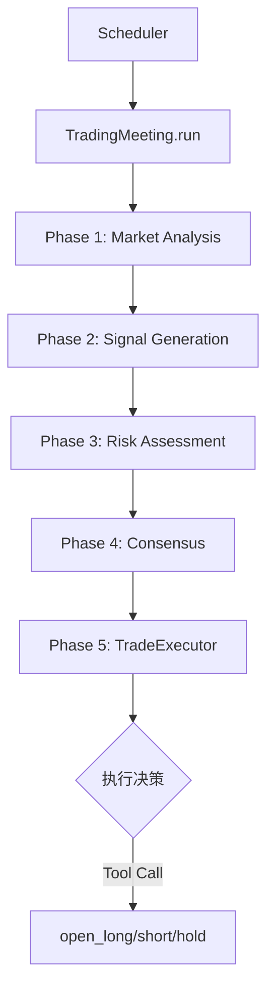
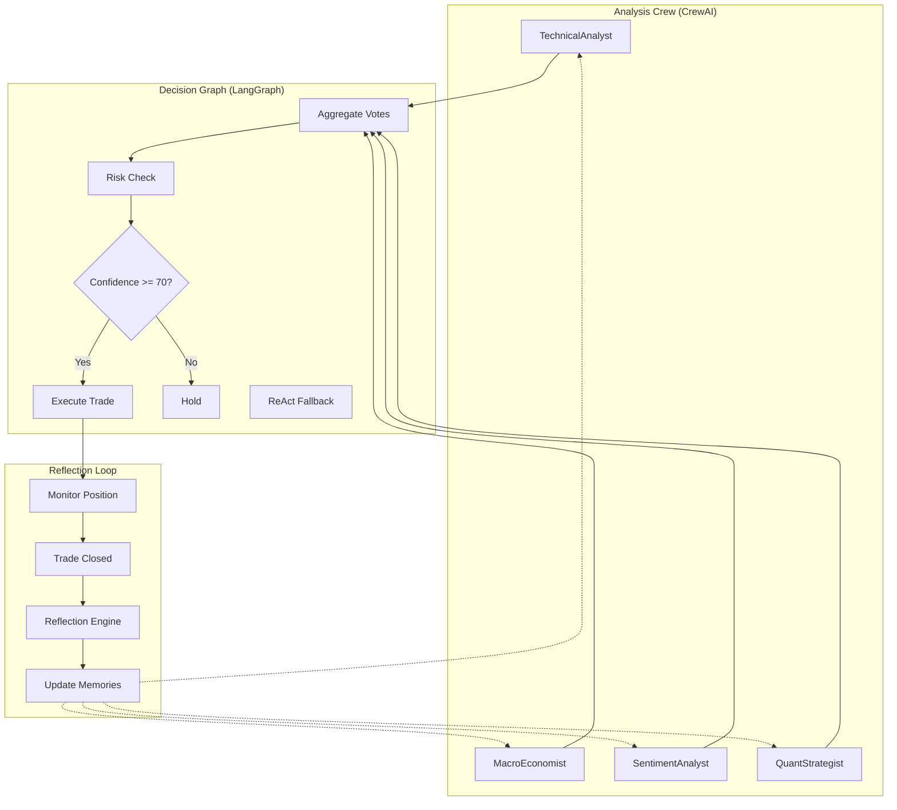

# 🤖 Trading Agent 架构升级方案

## 目标

评估当前 ReWOO 架构的优缺点，研究最新 Agent 范式，提出针对交易系统的最佳架构方案。

---

## 📊 当前架构分析

### 现有架构概述



### 当前 ReWOO 模式特点

| 特征 | 当前实现 |
|------|---------|
| **规划方式** | 预定义 5 阶段流程 |
| **Agent 协作** | 顺序投票，Leader 汇总 |
| **工具调用** | Phase 5 单次 LLM 调用 + 工具 |
| **反馈机制** | 仅平仓后反思 |
| **状态管理** | 手动 Redis 持久化 |

### 当前架构问题

| 问题 | 影响 | 严重度 |
|------|------|--------|
| **无中间观察** | 一旦计划失败，无法重新规划 | 🔴 高 |
| **执行路径刚性** | 无法根据市场变化动态调整 | 🔴 高 |
| **单点 LLM 调用** | TradeExecutor 失败即全失败 | 🟡 中 |
| **反馈滞后** | 只有平仓后才反思，无法实时学习 | 🟡 中 |
| **缺乏树搜索** | 无法探索多种策略可能性 | 🟡 中 |

---

## 🔬 Agent 范式对比 (2024-2025)

### 主要范式

| 范式 | 核心思想 | 优点 | 缺点 | 适用场景 |
|------|---------|------|------|---------|
| **ReAct** | 推理-行动-观察循环 | 适应性强，可实时调整 | Token 消耗高，延迟大 | 探索性任务 |
| **ReWOO** | 预规划+执行分离 | 效率高，成本低 | 适应性差，计划失败难恢复 | 确定性流程 |
| **Plan-and-Execute** | 先规划全部步骤再执行 | 快速，可并行 | 动态场景表现差 | 批量处理 |
| **LATS** | 蒙特卡洛树搜索决策 | 探索空间大，决策质量高 | 计算量大 | 复杂决策 |
| **Reflexion** | 自我反思学习 | 可从错误学习 | 需要多轮迭代 | 学习型任务 |
| **Hybrid** | 结合多种范式 | 兼顾效率与适应性 | 实现复杂 | 生产系统 |

### 针对交易系统的推荐

> **推荐采用 Hybrid 混合架构：ReWOO + ReAct 回退 + Reflexion 反馈**

理由：

1. **常规流程**：使用 ReWOO 高效执行预定义分析流程
2. **异常处理**：计划失败时回退到 ReAct 重新规划
3. **持续学习**：Reflexion 机制从每笔交易学习

---

## 🏗️ 框架对比

### LangGraph vs CrewAI

| 特性 | LangGraph | CrewAI |
|------|-----------|--------|
| **架构模式** | 图结构（节点+边） | 角色团队 |
| **状态管理** | ✅ 原生支持，细粒度控制 | ⚠️ 基础支持 |
| **工作流控制** | ✅ 循环、分支、条件 | ⚠️ 顺序/并行/层级 |
| **人工介入** | ✅ 任意节点暂停 | ✅ 支持 |
| **调试可视化** | ✅ 内置工作流可视化 | ⚠️ 需额外工具 |
| **学习曲线** | 📈 陡峭 | 📉 平缓 |
| **生产就绪** | ✅ 企业级 | ⚠️ 较新 |
| **交易适用性** | ✅ 高 | ✅ 中 |

### 推荐

> **推荐 LangGraph**
>
> - 交易系统需要精细的状态管理和条件分支
> - 需要强大的故障恢复和检查点机制
> - 适合复杂的多阶段决策流程

---

## 📋 改进方案

### 方案一：渐进式改进（推荐）

保持现有代码结构，逐步引入新范式特性。

#### Phase 1: 引入 ReAct 回退机制

```python
# trading_meeting.py - 增加回退逻辑

class TradingMeeting:
    async def run(self, context: str = None):
        try:
            # 正常 ReWOO 流程
            result = await self._run_rewoo_flow(context)
            return result
        except PlanExecutionError as e:
            # 回退到 ReAct 模式
            logger.warning(f"ReWOO failed, falling back to ReAct: {e}")
            return await self._run_react_fallback(context, error=e)
    
    async def _run_react_fallback(self, context, error):
        """ReAct 循环：推理-行动-观察"""
        max_iterations = 5
        observations = [f"Previous plan failed: {error}"]
        
        for i in range(max_iterations):
            # 1. 推理：分析当前状态
            thought = await self._reason(observations)
            
            # 2. 行动：选择下一步动作
            action = await self._act(thought)
            
            # 3. 观察：获取行动结果
            observation = await self._observe(action)
            observations.append(observation)
            
            if self._is_complete(action):
                return action.result
        
        return self._generate_hold_signal("ReAct max iterations reached")
```

#### Phase 2: 增强 Reflexion 机制

```python
# 交易后自动反思 + 记忆更新

class ReflectionEngine:
    async def reflect_on_trade(self, trade_result, votes, market_context):
        """交易后反思生成经验"""
        
        # 1. 生成反思
        reflection = await self._generate_reflection(
            outcome=trade_result,
            predictions=votes,
            context=market_context
        )
        
        # 2. 提取教训  
        lessons = await self._extract_lessons(reflection)
        
        # 3. 更新 Agent 记忆
        for agent_id, lesson in lessons.items():
            await self.memory_store.update_agent_memory(
                agent_id=agent_id,
                lesson=lesson,
                confidence_adjustment=self._calculate_adjustment(trade_result)
            )
        
        # 4. 更新 Agent 权重
        await self._update_agent_weights(trade_result, votes)
```

#### Phase 3: 引入 LangGraph 编排

```python
# 使用 LangGraph 重构工作流

from langgraph.graph import StateGraph, END

# 定义状态
class TradingState(TypedDict):
    market_data: dict
    agent_votes: List[AgentVote]
    risk_assessment: dict
    final_decision: Optional[TradingSignal]
    execution_result: Optional[dict]
    error: Optional[str]

# 构建图
def build_trading_graph():
    graph = StateGraph(TradingState)
    
    # 添加节点
    graph.add_node("market_analysis", market_analysis_node)
    graph.add_node("signal_generation", signal_generation_node)
    graph.add_node("risk_assessment", risk_assessment_node)
    graph.add_node("consensus", consensus_node)
    graph.add_node("execution", execution_node)
    graph.add_node("react_fallback", react_fallback_node)
    
    # 添加边
    graph.add_edge("market_analysis", "signal_generation")
    graph.add_edge("signal_generation", "risk_assessment")
    graph.add_edge("risk_assessment", "consensus")
    
    # 条件边：成功继续，失败回退
    graph.add_conditional_edges(
        "consensus",
        should_execute_or_fallback,
        {
            "execute": "execution",
            "fallback": "react_fallback"
        }
    )
    
    graph.add_edge("execution", END)
    graph.add_edge("react_fallback", END)
    
    return graph.compile()
```

---

### 方案二：完全重构（长期）

采用 LangGraph + CrewAI 混合架构，完全重写交易系统。

#### 目标架构



---

## 📊 与现有架构改进结合

结合之前的架构审计，以下是完整的改进路线：

### 短期 (1-2 周)

| 改进项 | 关联架构问题 | 新范式元素 |
|-------|-------------|-----------|
| 统一 AgentVote 模型 | P0-#2 | - |
| 统一 check_tp_sl 行为 | P0-#4 | - |
| 添加 ReAct 回退 | 新增 | ReAct 模式 |
| 增强错误处理 | P2-#11 | 故障恢复 |

### 中期 (1 个月)

| 改进项 | 关联架构问题 | 新范式元素 |
|-------|-------------|-----------|
| 拆分 trading_meeting.py | P0-#1 | 模块化 |
| 提取 TradeExecutor | P1-#6 | 关注点分离 |
| 引入 Reflexion | 新增 | 自我反思 |
| 实现动态 Agent 权重 | 新增 | 学习机制 |

### 长期 (3 个月+)

| 改进项 | 关联架构问题 | 新范式元素 |
|-------|-------------|-----------|
| 迁移到 LangGraph | P0-#3 | 图编排 |
| 引入 LATS 决策 | 新增 | 树搜索 |
| 多模态分析 | 新增 | K 线图视觉分析 |

---

## 🎯 实施建议

### 优先级排序

1. **立即实施**：ReAct 回退机制（防止计划失败导致系统瘫痪）
2. **尽快实施**：增强 Reflexion（从每笔交易学习）
3. **规划实施**：LangGraph 迁移（需要充分测试）

### 风险评估

| 改进 | 风险 | 缓解措施 |
|------|------|---------|
| ReAct 回退 | 增加 Token 消耗 | 限制迭代次数 |
| Reflexion | 反思质量不稳定 | A/B 测试 |
| LangGraph 迁移 | 大规模重构 | 保持接口兼容 |

### 成功指标

- **ReAct 回退**：计划失败恢复率 > 80%
- **Reflexion**：连续亏损后胜率回升
- **LangGraph**：代码行数减少 30%，可测试性提高

---

## 📚 参考资料

1. [ReAct: Synergizing Reasoning and Acting](https://arxiv.org/abs/2210.03629)
2. [ReWOO: Reasoning Without Observation](https://arxiv.org/abs/2305.18323)
3. [LATS: Language Agent Tree Search](https://arxiv.org/abs/2310.04406)
4. [Reflexion: Language Agents with Verbal Reinforcement](https://arxiv.org/abs/2303.11366)
5. [LangGraph Documentation](https://langchain-ai.github.io/langgraph/)
6. [Multi-Agent Trading Framework (arXiv 2024)](https://arxiv.org/abs/2408.06361)
