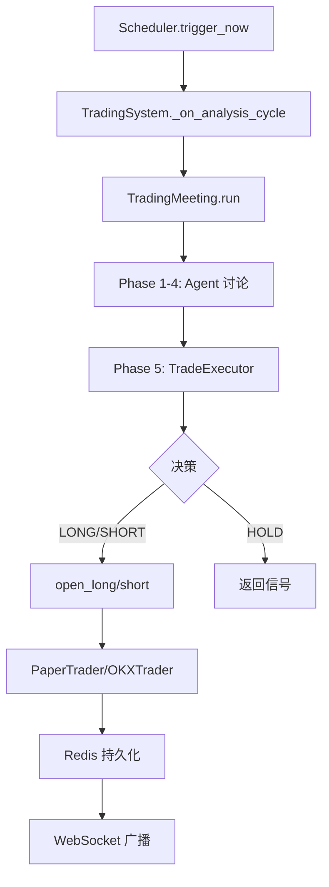

# 🔬 Trading System 深度架构审计报告

## 审计日期: 2025-12-30

## 审计范围: 核心交易系统 - 代码结构、数据流、设计模式、优化机会

---

## 📊 代码规模统计

| 文件 | 行数 | 类/函数数 | 职责 |
|------|------|----------|------|
| trading_meeting.py | 4,116 | 57 | 会议主持、决策生成 |
| trading_routes.py | 2,243 | 65 | API 路由、系统协调 |
| trading_tools.py | 1,635 | 32 | Agent 工具 |
| okx_trader.py | 1,476 | 34 | OKX 交易接口 |
| paper_trader.py | 892 | 39 | 模拟交易 |
| vote.py | 247 | 29 | 投票模型 |
| trading_models.py | 252 | 18 | Pydantic 模型 |
| **总计** | **10,861** | **274** | - |

---

## 📐 核心类架构

### 1. TradingSystem (trading_routes.py)

```
TradingSystem (中央协调器)
├── scheduler: TradingScheduler    # 定时触发
├── paper_trader: PaperTrader/OKXTrader  # 交易执行
├── cooldown_manager: CooldownManager  # 冷却控制
├── meeting: TradingMeeting        # 会议主持
└── ws_clients: Dict[str, WebSocket]  # WebSocket 广播
```

**🔍 观察：**

- ⚠️ TradingSystem 是"上帝类"，职责过多（766 行）
- ⚠️ 同时处理：协调、监控、WebSocket、回调、会议创建
- ✅ 建议：拆分为 SystemCoordinator + WebSocketManager + CallbackHandler

---

### 2. TradingMeeting (trading_meeting.py)

```
TradingMeeting (会议主持)
├── 5 个阶段:
│   ├── Phase 1: Market Analysis (分析)
│   ├── Phase 2: Signal Generation (投票)
│   ├── Phase 3: Risk Assessment (风控)
│   ├── Phase 4: Consensus (Leader 总结)
│   └── Phase 5: Execution (TradeExecutor)
├── _agent_votes: List[AgentVote]  # 投票记录
├── _final_signal: TradingSignal   # 最终信号
└── toolkit: TradingToolkit        # 工具集
```

**🔍 观察：**

- ⚠️ **文件过大**（4116 行），难以维护
- ⚠️ Phase 5 (TradeExecutor) 逻辑约 1500 行内嵌在类中
- ⚠️ 多个"备用"逻辑路径增加复杂度
- ✅ 建议：将 TradeExecutor 提取为独立类

---

### 3. Trader 层次结构

```
BaseTrader (抽象)
├── PaperTrader (本地模拟)
│   ├── _position: PaperPosition
│   ├── _account: PaperAccount
│   ├── _trade_lock: asyncio.Lock  ✅
│   └── Redis 状态持久化
│
└── OKXTrader (OKX API)
    ├── _client: OKXClient
    ├── _trade_lock: asyncio.Lock  ✅
    ├── _daily_pnl: float (日亏损限制)
    └── Redis 状态持久化
```

**🔍 观察：**

- ✅ 接口统一（open_long, open_short, close_position, get_position）
- ✅ 两者都有交易锁
- ⚠️ OKXTrader 比 PaperTrader 多 600 行，功能不完全对称
- ⚠️ check_tp_sl() 行为不一致：PaperTrader 会自动平仓，OKXTrader 只返回状态

---

## 📦 数据结构分析

### 投票相关（两套模型）

| 位置 | 模型 | 类型 | 用途 |
|------|------|------|------|
| domain/vote.py | VoteDirection | Enum | 方向枚举 |
| domain/vote.py | Vote | dataclass | 单次投票 |
| domain/vote.py | AgentVote | dataclass | 带元数据的投票 |
| domain/vote.py | VoteSummary | dataclass | 投票汇总 |
| trading_models.py | AgentVote | Pydantic | API 序列化 |

**⚠️ 问题：存在两个 AgentVote 定义！**

- `domain/vote.py` 的 AgentVote (dataclass)
- `trading_models.py` 的 AgentVote (Pydantic)
- 可能导致混淆和类型错误

---

### 信号模型

```python
TradingSignal (Pydantic)
├── direction: "long" | "short" | "hold"
├── symbol: str
├── leverage: int
├── amount_percent: float (0-1)
├── entry_price: float
├── take_profit_price: float
├── stop_loss_price: float
├── confidence: int (0-100)
├── reasoning: str
├── leader_summary: str
└── timestamp: datetime
```

**🔍 观察：**

- ✅ 结构完整
- ⚠️ `amount_percent` 命名不一致（有时是 0-1，有时是百分比）

---

### 仓位模型

| 模型 | 位置 | 用途 |
|------|------|------|
| PaperPosition | paper_trader.py | 本地仓位 |
| OKXPosition | okx_trader.py | OKX 仓位 |
| Position | trading_models.py | API 响应 |
| PositionContext | trading_meeting.py | 会议上下文 |

**⚠️ 问题：4 个仓位模型**

- 需要频繁转换
- 字段命名不完全一致
- 建议统一为一个核心模型

---

## 🔄 数据流分析

### 分析到执行的完整流程



**🔍 观察：**

- ✅ 流程清晰
- ⚠️ Phase 5 (TradeExecutor) 的执行逻辑过于复杂
- ⚠️ 有多个"备用路径"可能导致意外执行

---

## 🎯 发现的设计问题

### P0 - 关键问题

| # | 问题 | 影响 | 建议 |
|---|------|------|------|
| 1 | trading_meeting.py 过大 (4116 行) | 难以维护、测试 | 拆分为多个模块 |
| 2 | 两套 AgentVote 模型 | 类型混淆 | 统一使用 domain/vote.py |
| 3 | TradingSystem 职责过多 | 单点复杂度高 | 拆分职责 |
| 4 | check_tp_sl 行为不一致 | OKX/Paper 行为不同 | 统一行为 |

### P1 - 重要问题

| # | 问题 | 影响 | 建议 |
|---|------|------|------|
| 5 | 4 个仓位模型 | 转换繁琐 | 统一为一个核心模型 |
| 6 | TradeExecutor 内嵌 | 难以单独测试 | 提取为独立类 |
| 7 | 硬编码的 Symbol | BTC-USDT-SWAP 硬编码 | 统一配置管理 |
| 8 | 日志级别不一致 | 调试困难 | 制定日志规范 |

### P2 - 改进建议

| # | 问题 | 影响 | 建议 |
|---|------|------|------|
| 9 | 无单元测试 | 回归风险 | 添加核心逻辑测试 |
| 10 | 依赖注入不彻底 | 难以 mock | 使用依赖注入框架 |
| 11 | 错误处理不统一 | 调试困难 | 统一异常类型 |
| 12 | 魔法数字 | 可读性差 | 提取为常量 |

---

## 📋 具体优化建议

### 1. 拆分 trading_meeting.py

```
trading/
├── meeting/
│   ├── __init__.py           # TradingMeeting
│   ├── phases/
│   │   ├── analysis.py       # Phase 1
│   │   ├── signal.py         # Phase 2
│   │   ├── risk.py           # Phase 3
│   │   ├── consensus.py      # Phase 4
│   │   └── execution.py      # Phase 5 (TradeExecutor)
│   ├── prompts/
│   │   ├── leader.py         # Leader prompts
│   │   └── analyst.py        # Analyst prompts
│   └── utils/
│       ├── vote_calculator.py  # 投票计算
│       └── context_builder.py  # 上下文构建
```

### 2. 统一仓位模型

```python
# core/trading/domain/position.py
@dataclass
class Position:
    id: str
    symbol: str
    direction: Literal["long", "short"]
    size: float
    entry_price: float
    leverage: int
    margin: float
    tp_price: Optional[float] = None
    sl_price: Optional[float] = None
    current_price: float = 0.0
    unrealized_pnl: float = 0.0
    opened_at: datetime = field(default_factory=datetime.now)
    
    def calculate_pnl(self, price: float) -> Tuple[float, float]: ...
    def calculate_liquidation_price(self) -> float: ...
    def to_dict(self) -> dict: ...
    
    @classmethod
    def from_okx(cls, okx_data: dict) -> "Position": ...
    
    @classmethod
    def from_paper(cls, paper_position) -> "Position": ...
```

### 3. 提取 TradeExecutor 为独立类

```python
# core/trading/executor.py
class TradeExecutor:
    def __init__(
        self,
        paper_trader: Union[PaperTrader, OKXTrader],
        toolkit: TradingToolkit,
        llm_service: Any
    ): ...
    
    async def execute(
        self,
        votes: List[AgentVote],
        leader_summary: str,
        position_context: PositionContext
    ) -> TradingSignal: ...
```

### 4. 统一行为：check_tp_sl

```python
# 两个 Trader 的 check_tp_sl 都应该：
# 1. 检查是否触发
# 2. 返回 Optional[str] ("tp", "sl", "liquidation", None)
# 3. 不自动执行 close_position

# 由上层 PositionMonitor 统一处理后续动作
```

---

## 🔧 代码质量改进

### 硬编码问题示例

```python
# ❌ 当前
amount_usdt = min(available * 0.3, available - 500)  # 魔法数字

# ✅ 建议
POSITION_RATIO = 0.3
SAFETY_BUFFER = 500
amount_usdt = min(available * POSITION_RATIO, available - SAFETY_BUFFER)
```

### 错误处理改进

```python
# ❌ 当前
try:
    result = await self.paper_trader.open_long(...)
except Exception as e:
    logger.error(f"Error: {e}")

# ✅ 建议
class TradeExecutionError(Exception):
    def __init__(self, operation: str, reason: str, details: dict = None):
        self.operation = operation
        self.reason = reason
        self.details = details or {}

try:
    result = await self.paper_trader.open_long(...)
except TradeExecutionError as e:
    logger.error(f"Trade {e.operation} failed: {e.reason}", extra=e.details)
except Exception as e:
    logger.exception(f"Unexpected error in trade execution")
    raise TradeExecutionError("open_long", "unexpected", {"error": str(e)})
```

---

## ✅ 现有优点

1. **锁机制完善** - 关键交易操作都有 asyncio.Lock 保护
2. **Redis 持久化** - 状态可恢复
3. **WebSocket 实时推送** - 前端可实时更新
4. **多 Agent 投票机制** - 决策有民主基础
5. **风险限制** - 日亏损限制、Cooldown 机制
6. **OKX/Paper 统一接口** - 切换方便

---

## 📝 后续行动建议

### 短期（1-2 周）

- [ ] 统一 AgentVote 模型
- [ ] 统一 check_tp_sl 行为
- [ ] 提取常量，消除魔法数字

### 中期（1 个月）

- [ ] 拆分 trading_meeting.py
- [ ] 提取 TradeExecutor 为独立类
- [ ] 添加核心逻辑单元测试

### 长期（持续）

- [ ] 统一仓位模型
- [ ] 引入依赖注入
- [ ] 制定代码规范文档
