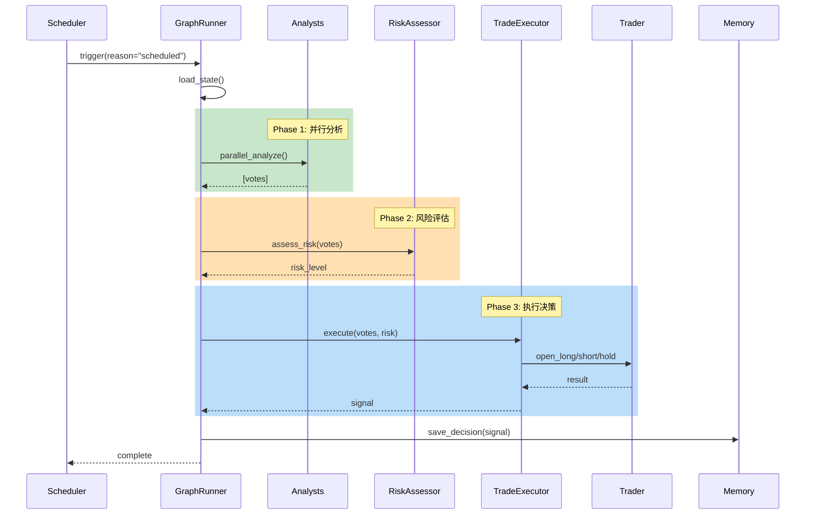
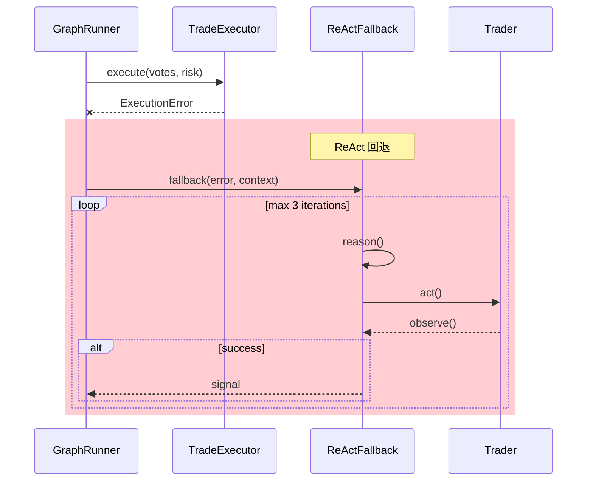
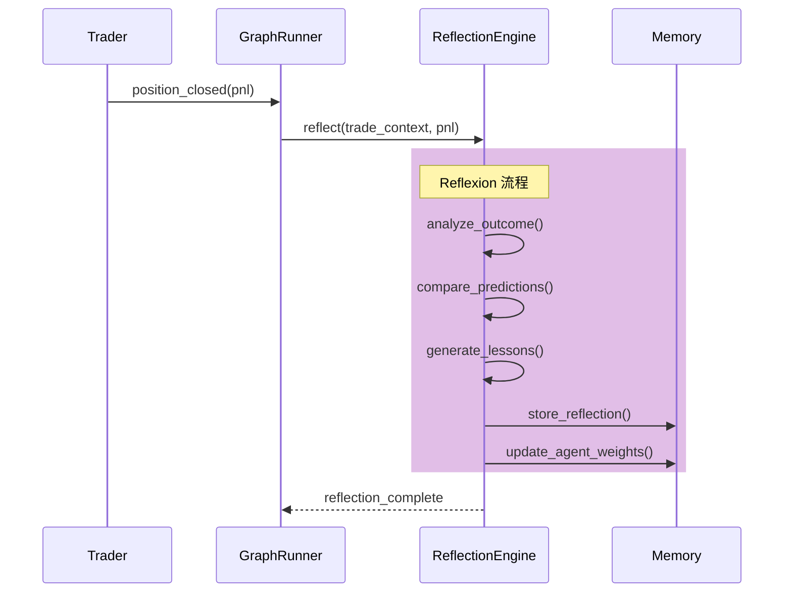

# 🏗️ Trading System 重构计划

## 版本: v2.0

## 创建日期: 2025-12-30

## 状态: 待审核

---

# 第一部分：目标架构

## 1.1 架构总览

```
┌─────────────────────────────────────────────────────────────────────────────┐
│                              Trading System v2.0                             │
├─────────────────────────────────────────────────────────────────────────────┤
│                                                                              │
│  ┌─────────────────────────────────────────────────────────────────────┐    │
│  │                        Orchestration Layer                           │    │
│  │  ┌───────────────┐  ┌───────────────┐  ┌───────────────────────┐    │    │
│  │  │  Scheduler    │  │  GraphRunner  │  │  StateManager         │    │    │
│  │  │  (触发器)     │  │  (LangGraph)  │  │  (状态 + Checkpoint)   │    │    │
│  │  └───────────────┘  └───────────────┘  └───────────────────────┘    │    │
│  └─────────────────────────────────────────────────────────────────────┘    │
│                                     │                                        │
│                                     ▼                                        │
│  ┌─────────────────────────────────────────────────────────────────────┐    │
│  │                          Agent Layer                                 │    │
│  │  ┌─────────────┐ ┌─────────────┐ ┌─────────────┐ ┌─────────────┐    │    │
│  │  │ Technical   │ │   Macro     │ │ Sentiment   │ │   Quant     │    │    │
│  │  │  Analyst    │ │ Economist   │ │  Analyst    │ │ Strategist  │    │    │
│  │  └─────────────┘ └─────────────┘ └─────────────┘ └─────────────┘    │    │
│  │  ┌─────────────┐ ┌─────────────┐ ┌─────────────────────────────┐    │    │
│  │  │    Risk     │ │   Trade     │ │     Reflection Engine       │    │    │
│  │  │  Assessor   │ │  Executor   │ │      (事后反思)              │    │    │
│  │  └─────────────┘ └─────────────┘ └─────────────────────────────┘    │    │
│  └─────────────────────────────────────────────────────────────────────┘    │
│                                     │                                        │
│                                     ▼                                        │
│  ┌─────────────────────────────────────────────────────────────────────┐    │
│  │                        Execution Layer                               │    │
│  │  ┌───────────────────────────────────────────────────────────────┐  │    │
│  │  │                   Unified Trader Interface                     │  │    │
│  │  │  ┌─────────────────────┐    ┌─────────────────────┐           │  │    │
│  │  │  │    PaperTrader      │    │     OKXTrader       │           │  │    │
│  │  │  └─────────────────────┘    └─────────────────────┘           │  │    │
│  │  └───────────────────────────────────────────────────────────────┘  │    │
│  └─────────────────────────────────────────────────────────────────────┘    │
│                                     │                                        │
│                                     ▼                                        │
│  ┌─────────────────────────────────────────────────────────────────────┐    │
│  │                         Memory Layer                                 │    │
│  │  ┌───────────────┐  ┌───────────────┐  ┌───────────────────────┐    │    │
│  │  │ Agent Memory  │  │ Trade History │  │  Reflection Store     │    │    │
│  │  │   (Redis)     │  │   (Redis)     │  │     (Redis)           │    │    │
│  │  └───────────────┘  └───────────────┘  └───────────────────────┘    │    │
│  └─────────────────────────────────────────────────────────────────────┘    │
│                                                                              │
└─────────────────────────────────────────────────────────────────────────────┘
```

## 1.2 Agent 能力定义

### 分析型 Agent

| Agent | 职责 | 输入 | 输出 | 工具 |
|-------|------|------|------|------|
| **TechnicalAnalyst** | K线、指标分析 | 市场数据 | 技术面评估 | get_klines, calculate_indicators |
| **MacroEconomist** | 宏观经济分析 | 新闻、ETF 流向 | 宏观面评估 | search_news, get_etf_flow |
| **SentimentAnalyst** | 市场情绪分析 | 社交媒体、FGI | 情绪评估 | get_fear_greed, search_social |
| **QuantStrategist** | 量化策略评估 | 历史数据 | 策略信号 | get_funding_rate, get_oi |
| **RiskAssessor** | 风险评估 | 仓位、市场波动 | 风险等级 | calculate_var, check_exposure |

### 决策型 Agent

| Agent | 职责 | 输入 | 输出 | 工具 |
|-------|------|------|------|------|
| **TradeExecutor** | 执行交易决策 | 投票汇总 + 风险评估 | 交易信号 | open_long, open_short, hold, close_position |

### 反思型 Agent

| Agent | 职责 | 触发时机 | 输出 |
|-------|------|---------|------|
| **ReflectionEngine** | 从交易结果学习 | 仓位平仓后 | 经验教训 + 权重调整建议 |

## 1.3 数据信息流

### 正常流程 (ReWOO 模式)



### 异常回退流程 (ReAct 模式)



### 反思流程 (Reflexion 模式)



---

# 第二部分：类结构重组

## 2.1 目录结构

```
backend/services/report_orchestrator/app/core/trading/
├── __init__.py
├── config.py                    # 统一配置管理
│
├── domain/                      # 领域模型 (统一)
│   ├── __init__.py
│   ├── position.py              # 统一 Position 模型
│   ├── signal.py                # TradingSignal
│   ├── vote.py                  # Vote, AgentVote, VoteSummary
│   └── account.py               # Account 模型
│
├── agents/                      # Agent 定义
│   ├── __init__.py
│   ├── base.py                  # BaseAnalyst 抽象类
│   ├── technical.py             # TechnicalAnalyst
│   ├── macro.py                 # MacroEconomist
│   ├── sentiment.py             # SentimentAnalyst
│   ├── quant.py                 # QuantStrategist
│   ├── risk.py                  # RiskAssessor
│   └── executor.py              # TradeExecutor (从 trading_meeting.py 提取)
│
├── orchestration/               # 编排层 (新增)
│   ├── __init__.py
│   ├── graph.py                 # LangGraph 工作流定义
│   ├── state.py                 # 状态管理
│   ├── nodes.py                 # 图节点定义
│   └── edges.py                 # 条件边定义
│
├── reflection/                  # 反思引擎 (新增)
│   ├── __init__.py
│   ├── engine.py                # ReflectionEngine
│   ├── memory.py                # 经验记忆存储
│   └── weight_adjuster.py       # 动态权重调整
│
├── execution/                   # 执行层
│   ├── __init__.py
│   ├── base_trader.py           # BaseTrader 接口
│   ├── paper_trader.py          # PaperTrader (重构)
│   ├── okx_trader.py            # OKXTrader (重构)
│   └── smart_executor.py        # 分片执行
│
├── tools/                       # Agent 工具
│   ├── __init__.py
│   ├── analysis.py              # 分析工具
│   ├── market.py                # 市场数据工具
│   └── trading.py               # 交易执行工具
│
├── safety/                      # 安全控制 (新增)
│   ├── __init__.py
│   ├── guards.py                # 安全守卫
│   ├── rate_limiter.py          # 频率限制
│   └── validators.py            # 参数验证
│
└── scheduler.py                 # 调度器 (保留)
```

## 2.2 核心类设计

### 2.2.1 统一 Position 模型

```python
# domain/position.py
from dataclasses import dataclass, field
from datetime import datetime
from typing import Optional, Literal, Tuple

@dataclass
class Position:
    """统一仓位模型 - 替代 PaperPosition, OKXPosition, Position (models)"""
    id: str
    symbol: str
    direction: Literal["long", "short"]
    size: float
    entry_price: float
    leverage: int
    margin: float
    
    tp_price: Optional[float] = None
    sl_price: Optional[float] = None
    liquidation_price: Optional[float] = None
    
    current_price: float = 0.0
    unrealized_pnl: float = 0.0
    unrealized_pnl_percent: float = 0.0
    
    opened_at: datetime = field(default_factory=datetime.now)
    source: Literal["paper", "okx"] = "paper"
    
    def calculate_pnl(self, price: float) -> Tuple[float, float]:
        """计算 PnL"""
        if self.direction == "long":
            pnl = (price - self.entry_price) / self.entry_price * self.margin * self.leverage
        else:
            pnl = (self.entry_price - price) / self.entry_price * self.margin * self.leverage
        pnl_percent = pnl / self.margin * 100 if self.margin else 0
        return pnl, pnl_percent
    
    def calculate_liquidation_price(self) -> float:
        """计算强平价格"""
        margin_ratio = 0.8  # 80% 保证金使用时强平
        if self.direction == "long":
            return self.entry_price * (1 - margin_ratio / self.leverage)
        else:
            return self.entry_price * (1 + margin_ratio / self.leverage)
    
    def to_dict(self) -> dict:
        return {
            "id": self.id,
            "symbol": self.symbol,
            "direction": self.direction,
            "size": self.size,
            "entry_price": self.entry_price,
            "leverage": self.leverage,
            "margin": self.margin,
            "tp_price": self.tp_price,
            "sl_price": self.sl_price,
            "liquidation_price": self.liquidation_price,
            "current_price": self.current_price,
            "unrealized_pnl": self.unrealized_pnl,
            "unrealized_pnl_percent": self.unrealized_pnl_percent,
            "opened_at": self.opened_at.isoformat(),
            "source": self.source
        }
    
    @classmethod
    def from_okx(cls, okx_data: dict) -> "Position":
        """从 OKX API 响应创建"""
        return cls(
            id=okx_data.get("posId", ""),
            symbol=okx_data.get("instId", "BTC-USDT-SWAP"),
            direction="long" if okx_data.get("posSide") == "long" else "short",
            size=float(okx_data.get("pos", 0)),
            entry_price=float(okx_data.get("avgPx", 0)),
            leverage=int(okx_data.get("lever", 1)),
            margin=float(okx_data.get("margin", 0)),
            liquidation_price=float(okx_data.get("liqPx", 0)) if okx_data.get("liqPx") else None,
            source="okx"
        )
```

### 2.2.2 LangGraph 工作流

```python
# orchestration/graph.py
from langgraph.graph import StateGraph, END
from typing import TypedDict, List, Optional

class TradingState(TypedDict):
    """工作流状态"""
    # 输入
    trigger_reason: str
    market_data: dict
    position_context: Optional[dict]
    
    # 中间状态
    agent_votes: List[dict]
    risk_assessment: dict
    leader_summary: str
    
    # 输出
    final_signal: Optional[dict]
    execution_result: Optional[dict]
    
    # 控制
    error: Optional[str]
    should_fallback: bool
    iteration_count: int

def build_trading_graph() -> StateGraph:
    """构建交易决策图"""
    graph = StateGraph(TradingState)
    
    # 添加节点
    graph.add_node("market_analysis", market_analysis_node)
    graph.add_node("signal_generation", signal_generation_node)
    graph.add_node("risk_assessment", risk_assessment_node)
    graph.add_node("consensus", consensus_node)
    graph.add_node("execution", execution_node)
    graph.add_node("react_fallback", react_fallback_node)
    graph.add_node("reflection", reflection_node)
    
    # 正常流程边
    graph.add_edge("market_analysis", "signal_generation")
    graph.add_edge("signal_generation", "risk_assessment")
    graph.add_edge("risk_assessment", "consensus")
    
    # 条件边：执行或回退
    graph.add_conditional_edges(
        "consensus",
        should_execute_or_fallback,
        {
            "execute": "execution",
            "fallback": "react_fallback"
        }
    )
    
    # 执行后触发反思
    graph.add_conditional_edges(
        "execution",
        should_reflect,
        {
            "reflect": "reflection",
            "end": END
        }
    )
    
    graph.add_edge("react_fallback", END)
    graph.add_edge("reflection", END)
    
    # 设置入口
    graph.set_entry_point("market_analysis")
    
    return graph.compile()
```

### 2.2.3 TradeExecutor (提取)

```python
# agents/executor.py
from typing import List, Optional
from app.core.trading.domain.vote import AgentVote, VoteSummary
from app.core.trading.domain.signal import TradingSignal
from app.core.trading.safety.guards import SafetyGuard

class TradeExecutor:
    """交易执行器 - 从 trading_meeting.py 提取"""
    
    def __init__(
        self,
        trader,  # PaperTrader or OKXTrader
        llm_service,
        toolkit,
        safety_guard: SafetyGuard
    ):
        self.trader = trader
        self.llm = llm_service
        self.toolkit = toolkit
        self.safety = safety_guard
        self._current_context: Optional[str] = None
    
    async def execute(
        self,
        votes: List[AgentVote],
        risk_assessment: dict,
        position_context: dict,
        context: str = None
    ) -> TradingSignal:
        """执行交易决策"""
        self._current_context = context
        
        # 1. 安全检查
        safety_result = await self.safety.pre_execution_check(
            votes=votes,
            position=position_context,
            context=context
        )
        if not safety_result.allowed:
            return self._generate_blocked_signal(safety_result.reason)
        
        # 2. 汇总投票
        vote_summary = VoteSummary(votes)
        
        # 3. 构建 LLM 提示
        tools = self.toolkit.get_execution_tools()
        prompt = self._build_execution_prompt(vote_summary, risk_assessment, position_context)
        
        # 4. 调用 LLM 决策
        try:
            result = await self.llm.generate_with_tools(
                prompt=prompt,
                tools=tools,
                max_iterations=3
            )
            return self._parse_execution_result(result)
        except Exception as e:
            raise ExecutionError(f"LLM execution failed: {e}")
    
    async def execute_with_react_fallback(
        self,
        votes: List[AgentVote],
        risk_assessment: dict,
        position_context: dict,
        error: Exception,
        max_iterations: int = 3
    ) -> TradingSignal:
        """ReAct 回退执行"""
        observations = [f"Previous attempt failed: {error}"]
        
        for i in range(max_iterations):
            # Reason
            thought = await self._reason(observations, position_context)
            
            # Act
            action = await self._act(thought)
            
            # Observe
            observation = await self._observe(action)
            observations.append(observation)
            
            if action.is_terminal:
                return action.signal
        
        # 达到最大迭代，返回 HOLD
        return self._generate_hold_signal("ReAct max iterations reached")
```

### 2.2.4 ReflectionEngine

```python
# reflection/engine.py
from typing import List, Dict
from datetime import datetime

class ReflectionEngine:
    """反思引擎 - 从交易结果学习"""
    
    def __init__(self, llm_service, memory_store, weight_adjuster):
        self.llm = llm_service
        self.memory = memory_store
        self.weight_adjuster = weight_adjuster
    
    async def reflect_on_trade(
        self,
        trade_id: str,
        entry_signal: dict,
        exit_result: dict,
        agent_votes: List[dict],
        market_context: dict
    ) -> Dict:
        """对已完成交易进行反思"""
        
        pnl = exit_result.get("pnl", 0)
        is_win = pnl > 0
        
        # 1. 生成反思
        reflection = await self._generate_reflection(
            signal=entry_signal,
            result=exit_result,
            votes=agent_votes,
            context=market_context
        )
        
        # 2. 提取每个 Agent 的教训
        lessons = await self._extract_agent_lessons(
            reflection=reflection,
            votes=agent_votes,
            outcome=exit_result
        )
        
        # 3. 存储反思
        reflection_record = {
            "trade_id": trade_id,
            "timestamp": datetime.now().isoformat(),
            "pnl": pnl,
            "is_win": is_win,
            "reflection": reflection,
            "lessons": lessons
        }
        await self.memory.store_reflection(reflection_record)
        
        # 4. 更新 Agent 权重
        weight_updates = await self.weight_adjuster.calculate_adjustments(
            votes=agent_votes,
            outcome=exit_result
        )
        await self.weight_adjuster.apply_adjustments(weight_updates)
        
        return reflection_record
    
    async def _generate_reflection(self, signal, result, votes, context) -> str:
        """LLM 生成反思"""
        prompt = f"""
        ## 交易反思
        
        ### 交易决策
        - 方向: {signal['direction']}
        - 信心: {signal['confidence']}%
        - 入场理由: {signal['reasoning']}
        
        ### 各 Agent 投票
        {self._format_votes(votes)}
        
        ### 交易结果
        - PnL: ${result['pnl']:.2f}
        - 平仓原因: {result['close_reason']}
        
        ### 请分析
        1. 哪些 Agent 的判断正确？为什么？
        2. 哪些 Agent 的判断错误？为什么？
        3. 整体决策流程有什么可以改进的？
        4. 下次遇到类似情况应该注意什么？
        
        请用简洁的语言回答，每点不超过 50 字。
        """
        
        return await self.llm.generate(prompt)
```

---

# 第三部分：安全控制

## 3.1 安全守卫

```python
# safety/guards.py
from dataclasses import dataclass
from typing import List, Optional
from enum import Enum

class BlockReason(Enum):
    STARTUP_PROTECTION = "startup_protection"
    DAILY_LOSS_LIMIT = "daily_loss_limit"
    COOLDOWN_ACTIVE = "cooldown_active"
    INVALID_PARAMS = "invalid_params"
    CONCURRENT_EXECUTION = "concurrent_execution"
    OKX_HEDGE_MODE = "okx_hedge_mode"

@dataclass
class SafetyCheckResult:
    allowed: bool
    reason: Optional[BlockReason] = None
    message: str = ""

class SafetyGuard:
    """交易安全守卫"""
    
    def __init__(self, trader, cooldown_manager, config):
        self.trader = trader
        self.cooldown = cooldown_manager
        self.config = config
        self._execution_lock = asyncio.Lock()
    
    async def pre_execution_check(
        self,
        votes: List,
        position: dict,
        context: str = None
    ) -> SafetyCheckResult:
        """执行前安全检查"""
        
        # 1. 并发检查
        if self._execution_lock.locked():
            return SafetyCheckResult(
                allowed=False,
                reason=BlockReason.CONCURRENT_EXECUTION,
                message="Another execution is in progress"
            )
        
        # 2. Startup 保护
        if context == "startup" and position.get("has_position"):
            direction = votes[0].direction if votes else None
            current_direction = position.get("direction")
            if direction and direction.value != current_direction:
                return SafetyCheckResult(
                    allowed=False,
                    reason=BlockReason.STARTUP_PROTECTION,
                    message=f"Blocked reverse from {current_direction} to {direction.value} during startup"
                )
        
        # 3. 日亏损限制
        daily_check = self.trader._check_daily_loss_limit()
        if not daily_check[0]:
            return SafetyCheckResult(
                allowed=False,
                reason=BlockReason.DAILY_LOSS_LIMIT,
                message=daily_check[1]
            )
        
        # 4. Cooldown 检查
        if not self.cooldown.check_cooldown():
            return SafetyCheckResult(
                allowed=False,
                reason=BlockReason.COOLDOWN_ACTIVE,
                message="System in cooldown after consecutive losses"
            )
        
        # 5. OKX Hedge Mode 检查
        if hasattr(self.trader, 'is_hedge_mode') and self.trader.is_hedge_mode:
            if position.get("has_position"):
                return SafetyCheckResult(
                    allowed=False,
                    reason=BlockReason.OKX_HEDGE_MODE,
                    message="OKX hedge mode: Cannot auto-close existing position"
                )
        
        return SafetyCheckResult(allowed=True)
    
    async def validate_trade_params(
        self,
        direction: str,
        leverage: int,
        amount_usdt: float,
        tp_price: float,
        sl_price: float
    ) -> SafetyCheckResult:
        """验证交易参数"""
        
        # 杠杆限制
        if leverage > self.config.max_leverage:
            return SafetyCheckResult(
                allowed=False,
                reason=BlockReason.INVALID_PARAMS,
                message=f"Leverage {leverage} exceeds max {self.config.max_leverage}"
            )
        
        # 金额限制
        account = await self.trader.get_account()
        max_amount = account.get("available_balance", 0) * self.config.max_position_percent
        if amount_usdt > max_amount:
            return SafetyCheckResult(
                allowed=False,
                reason=BlockReason.INVALID_PARAMS,
                message=f"Amount ${amount_usdt} exceeds max ${max_amount}"
            )
        
        # TP/SL 合理性
        current_price = await self.trader.get_current_price()
        if direction == "long":
            if tp_price <= current_price or sl_price >= current_price:
                return SafetyCheckResult(
                    allowed=False,
                    reason=BlockReason.INVALID_PARAMS,
                    message="Invalid TP/SL for long position"
                )
        else:
            if tp_price >= current_price or sl_price <= current_price:
                return SafetyCheckResult(
                    allowed=False,
                    reason=BlockReason.INVALID_PARAMS,
                    message="Invalid TP/SL for short position"
                )
        
        return SafetyCheckResult(allowed=True)
```

## 3.2 安全检查清单

| 检查项 | 检查时机 | 当前状态 | 重构后 |
|-------|---------|---------|--------|
| Startup 反向保护 | 执行前 | ✅ 已修复 | ✅ SafetyGuard |
| 日亏损限制 | 执行前 | ✅ OKXTrader | ✅ 统一接口 |
| Cooldown 检查 | 执行前 | ✅ CooldownManager | ✅ 集成 |
| 并发锁 | 执行全程 | ✅ _trade_lock | ✅ _execution_lock |
| 参数验证 | 执行前 | ⚠️ 分散 | ✅ 统一验证器 |
| OKX Hedge Mode | 执行前 | ✅ 已修复 | ✅ SafetyGuard |
| 文本推断禁用 | 解析时 | ✅ 已移除 | ✅ 不存在 |
| Fallback 执行禁用 | 执行时 | ✅ 已移除 | ✅ 用 ReAct 替代 |

---

# 第四部分：实施步骤

## Phase 1: 基础重构 (Week 1-2) ✅ 完成

### Step 1.1: 统一领域模型

- [x] 创建 `domain/unified_position.py` 统一 Position 模型
- [x] 创建 `domain/account.py` 统一 Account 模型
- [ ] 修改 PaperTrader 使用新模型 (暂缓)
- [ ] 修改 OKXTrader 使用新模型 (暂缓)
- [ ] 更新 API 响应使用新模型 (暂缓)

### Step 1.2: 提取 TradeExecutor

- [x] 创建 `executor.py`
- [x] 从 `trading_meeting.py` 提取 Phase 5 逻辑
- [x] 提取执行相关常量到 `config.py`
- [x] 更新 TradingMeeting 使用新 TradeExecutor

### Step 1.3: 统一安全控制

- [x] 创建 `safety/guards.py`
- [x] 验证器集成到 guards.py
- [x] 集成到 TradeExecutor

## Phase 2: 添加 ReAct 回退 (Week 3) ✅ 完成

### Step 2.1: 实现 ReAct 逻辑

- [x] 在 TradeExecutor 添加 `_react_fallback`
- [x] 定义 ReAct 工具集 (简化版)
- [x] 添加迭代限制 (max 3) 和安全回退

### Step 2.2: 集成到主流程

- [x] TradeExecutor 内置异常捕获
- [x] 自动触发 ReAct 回退
- [x] 添加日志和监控

## Phase 3: 实现 Reflexion (Week 4) ✅ 完成

### Step 3.1: 创建反思引擎

- [x] 创建 `reflection/engine.py` (含 Memory + WeightAdjuster)
- [x] TradeReflection 数据模型
- [x] LLM 驱动的反思生成

### Step 3.2: 集成到交易流程

- [x] 在仓位平仓后触发反思
- [x] 存储反思到 Redis
- [x] Agent 权重自动调整

## Phase 4: LangGraph 迁移 (Week 5-6) ✅ 完成

### Step 4.1: 创建图结构

- [x] 创建 `orchestration/graph.py`
- [x] 创建 `orchestration/nodes.py`
- [x] 创建 `orchestration/state.py`

### Step 4.2: 迁移阶段逻辑

- [x] market_analysis_node
- [x] signal_generation_node
- [x] risk_assessment_node
- [x] consensus_node
- [x] execution_node + react_fallback_node + reflection_node

### Step 4.3: 测试和验证

- [ ] 单元测试每个节点 (待完成)
- [ ] 集成测试完整流程 (待完成)
- [ ] A/B 测试新旧系统 (待完成)

## Phase 5: 清理和优化 (Week 7-8) ✅ 完成

### Step 5.1: 代码清理

- [x] 更新 trading/**init**.py 导出新模块
- [x] 保留 TradingMeeting 向后兼容
- [x] 更新所有导入路径

### Step 5.2: 文档和测试

- [x] 编写架构文档 (ARCHITECTURE.md)
- [ ] 更新 API 文档 (待完成)
- [ ] 添加单元测试覆盖 (待完成)

---

# 第五部分：验收标准

| 指标 | 当前值 | 目标值 |
|------|--------|--------|
| trading_meeting.py 行数 | 4,116 | < 500 |
| 重复模型数量 | 4 | 1 |
| 安全检查覆盖率 | 分散 | 100% 集中 |
| 执行失败恢复率 | 0% | > 80% |
| 代码测试覆盖率 | ~0% | > 60% |

---

# 附录：风险和缓解

| 风险 | 影响 | 缓解措施 |
|------|------|---------|
| LangGraph 学习曲线 | 开发延迟 | 先在独立分支验证 |
| 迁移过程中断服务 | 交易中断 | 保持双轨运行直到稳定 |
| 新 bug 引入 | 意外交易 | 先在 PaperTrader 验证 |
| 性能回退 | 延迟增加 | 基准测试对比 |
