# Agent Data Flow Visualization

This document provides detailed visualization of data flow between agents in the Magellan Trading System.

## Table of Contents
1. [Overview](#overview)
2. [Message Bus Architecture](#message-bus-architecture)
3. [Phase-by-Phase Data Flow](#phase-by-phase-data-flow)
4. [Agent Input/Output Matrix](#agent-inputoutput-matrix)
5. [Data Transformation Pipeline](#data-transformation-pipeline)

---

## Overview

### High-Level Agent Communication


---

## Message Bus Architecture

The Message Bus is the central communication hub for all agents. Each phase contributes messages that subsequent phases can read.


---

## Phase-by-Phase Data Flow

### Phase 1: Market Analysis

```mermaid
flowchart LR
    subgraph Input["📥 Input"]
        PC[Position Context]
        AM[Agent Memory]
        SP[System Prompt]
    end
    
    subgraph Agent["🤖 Analyst Agent"]
        direction TB
        P1[1. Receive Context]
        P2[2. Call Tools]
        P3[3. Analyze Data]
        P4[4. Generate Response]
        P1 --> P2 --> P3 --> P4
    end
    
    subgraph Output["📤 Output"]
        AN[Analysis Text]
    end
    
    PC --> P1
    AM --> P1
    SP --> P1
    P4 --> AN
    
    style Input fill:#e3f2fd
    style Agent fill:#fff3e0
    style Output fill:#e8f5e9
```



**Data Passed to Each Analyst:**

| Data Element | Source | Purpose |
|-------------|--------|---------|
| `system_prompt` | Agent Config | Role definition and expertise |
| `position_context.to_summary()` | PositionContext | Current position status |
| `memory.get_context_for_prompt()` | AgentMemory | Historical performance |
| `analysis_prompt` | TradingMeeting | Phase instructions |

---

### Phase 2: Signal Generation

```mermaid
flowchart TB
    subgraph Input["📥 From Phase 1"]
        AH[Analysis History]
        PC[Position Context]
        DO[Decision Options Matrix]
    end
    
    subgraph Voting["🗳️ Voting Process"]
        direction LR
        TA[TechnicalAnalyst]
        MA[MacroEconomist]
        SA[SentimentAnalyst]
        QS[QuantStrategist]
    end
    
    subgraph Parsing["⚙️ Vote Parsing"]
        JP[JSON Parser]
        FB[Fallback Parser]
        NM[Direction Normalizer]
    end
    
    subgraph Output["📤 Vote Collection"]
        V1["Vote 1: {direction, confidence, leverage, tp%, sl%, reasoning}"]
        V2["Vote 2: {...}"]
        V3["Vote 3: {...}"]
        V4["Vote 4: {...}"]
        SUM[Votes Summary]
    end
    
    AH --> TA & MA & SA & QS
    PC --> TA & MA & SA & QS
    DO --> TA & MA & SA & QS
    
    TA --> JP
    MA --> JP
    SA --> JP
    QS --> JP
    JP --> FB
    FB --> NM
    
    NM --> V1 & V2 & V3 & V4
    V1 & V2 & V3 & V4 --> SUM
    
    style Input fill:#e3f2fd
    style Voting fill:#fff3e0
    style Output fill:#e8f5e9
```



**Vote JSON Structure:**
```json
{
  "direction": "long",
  "confidence": 75,
  "leverage": 5,
  "take_profit_percent": 5.0,
  "stop_loss_percent": 2.0,
  "reasoning": "RSI oversold + MACD bullish crossover"
}
```

---

### Phase 3: Risk Assessment

```mermaid
flowchart LR
    subgraph Input["📥 Input"]
        VS[Votes Summary<br/>3 Long / 0 Short / 1 Hold]
        PC[Position Context]
        RC[Risk Context]
    end
    
    subgraph RiskAssessor["⚖️ RiskAssessor"]
        E1[Evaluate Direction Justification]
        E2[Check Leverage vs Confidence]
        E3[Validate TP/SL Settings]
        E4[Assess Position Size]
        E5[Market Volatility Check]
        E1 --> E2 --> E3 --> E4 --> E5
    end
    
    subgraph Output["📤 Output"]
        RA[Risk Assessment Text]
        REC[Recommendations]
    end
    
    VS --> E1
    PC --> E1
    RC --> E1
    E5 --> RA & REC
    
    style Input fill:#e3f2fd
    style RiskAssessor fill:#ffebee
    style Output fill:#e8f5e9
```



---

### Phase 4: Consensus Building


---

### Phase 5: Trade Execution

```mermaid
flowchart TB
    subgraph Input["📥 Decision Input"]
        VR[Vote Results]
        PS[Position Status]
        LS[Leader Summary]
    end
    
    subgraph TradeExecutor["🎯 TradeExecutor"]
        D1{High Consensus?}
        D2{Has Opposite Position?}
        D3{Split Opinions?}
    end
    
    subgraph Tools["🔧 Available Tools"]
        OL[open_long]
        OS[open_short]
        CP[close_position]
        HD[hold]
    end
    
    subgraph Output["📤 Trade Signal"]
        TS["TradingSignal {<br/>direction, leverage,<br/>entry, tp, sl,<br/>confidence, reasoning}"]
    end
    
    VR --> D1
    PS --> D2
    LS --> D1
    
    D1 -->|Yes: 3-4 same direction| OL & OS
    D2 -->|Yes| CP
    D3 -->|Yes| HD
    D1 -->|No| HD
    
    OL & OS & CP & HD --> TS
    
    style Input fill:#e3f2fd
    style TradeExecutor fill:#f3e5f5
    style Tools fill:#fff3e0
    style Output fill:#e8f5e9
```



---

## Agent Input/Output Matrix

| Agent | Inputs | Outputs | Tools Used |
|-------|--------|---------|------------|
| **TechnicalAnalyst** | Position Context, Memory, Market Data | Analysis Text, Vote JSON | `get_market_price`, `get_technical_indicators`, `get_funding_rate` |
| **MacroEconomist** | Position Context, Memory, News Data | Analysis Text, Vote JSON | `tavily_search` |
| **SentimentAnalyst** | Position Context, Memory, Sentiment Data | Analysis Text, Vote JSON | `get_fear_greed_index` |
| **QuantStrategist** | Position Context, Memory, Statistical Data | Analysis Text, Vote JSON | `get_technical_indicators` |
| **RiskAssessor** | All Votes, Position Context, Risk Metrics | Risk Evaluation Text | None (advisory) |
| **Leader** | Full Conversation, Position Context, Guidance | Meeting Summary | None (synthesis) |
| **TradeExecutor** | Votes, Summary, Position Status | Trade Execution | `open_long`, `open_short`, `close_position`, `hold` |

---

## Data Transformation Pipeline


---

## Context Injection Points

Each agent receives context at specific points in the prompt:

```mermaid
flowchart TB
    subgraph SystemPrompt["📝 System Prompt Layer"]
        SP1[Role Definition]
        SP2[Expertise Description]
        SP3[Output Format Instructions]
    end
    
    subgraph MemoryContext["🧠 Memory Context Layer"]
        MC1[Last Trade Summary]
        MC2[Win Rate & P&L Stats]
        MC3[Lessons Learned]
        MC4[Current Focus]
    end
    
    subgraph PositionContext["📊 Position Context Layer"]
        PC1[Has Position? Direction?]
        PC2[Entry Price & Current Price]
        PC3[Unrealized P&L]
        PC4[Distance to TP/SL]
        PC5[Liquidation Distance]
    end
    
    subgraph PhasePrompt["🎯 Phase-Specific Prompt"]
        PP1[Analysis Instructions]
        PP2[Vote Format Requirements]
        PP3[Decision Options Matrix]
    end
    
    subgraph FinalPrompt["📨 Final Agent Prompt"]
        FP[Combined Context]
    end
    
    SP1 & SP2 & SP3 --> FP
    MC1 & MC2 & MC3 & MC4 --> FP
    PC1 & PC2 & PC3 & PC4 & PC5 --> FP
    PP1 & PP2 & PP3 --> FP
    
    style SystemPrompt fill:#e3f2fd
    style MemoryContext fill:#fff3e0
    style PositionContext fill:#e8f5e9
    style PhasePrompt fill:#fce4ec
    style FinalPrompt fill:#f3e5f5
```



---

## Related Documents

- [ARCHITECTURE.md](./ARCHITECTURE.md) - System architecture overview
- [PHASE_DETAILS.md](./PHASE_DETAILS.md) - Detailed phase breakdowns
- [MEMORY_SYSTEM.md](./MEMORY_SYSTEM.md) - Agent memory and reflection

---

*Last Updated: 2024-12-09*
