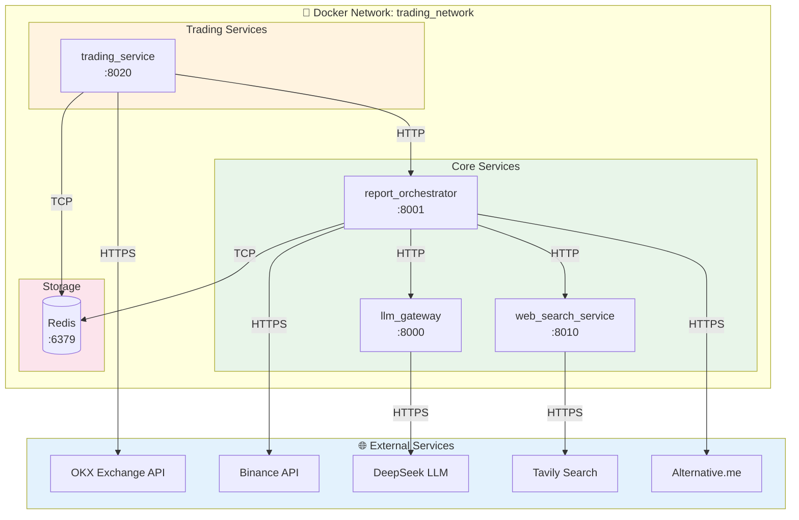
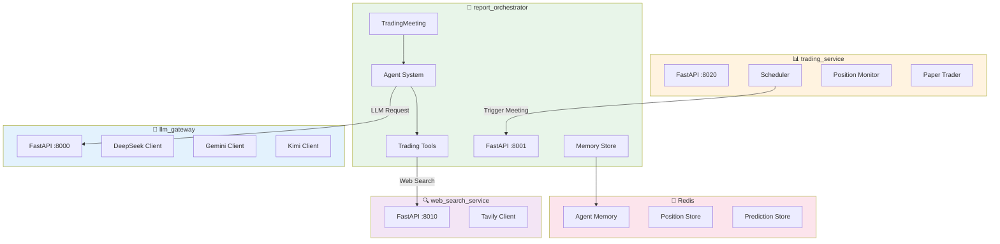
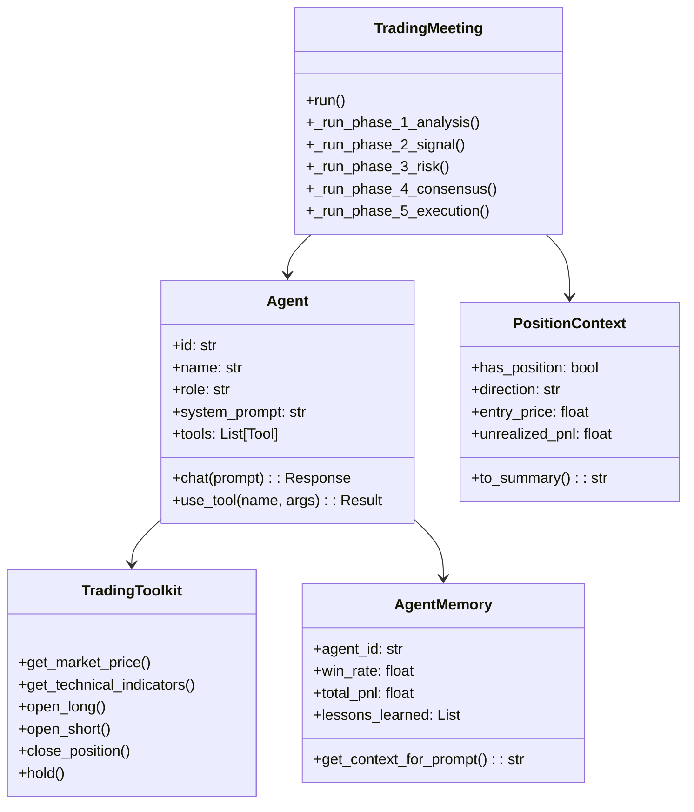
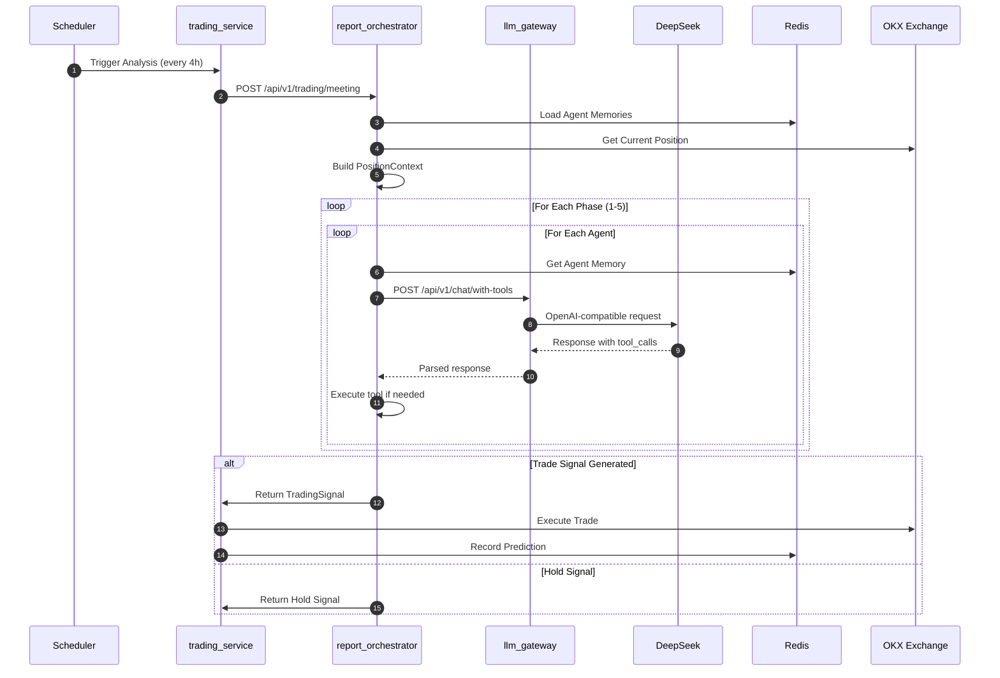
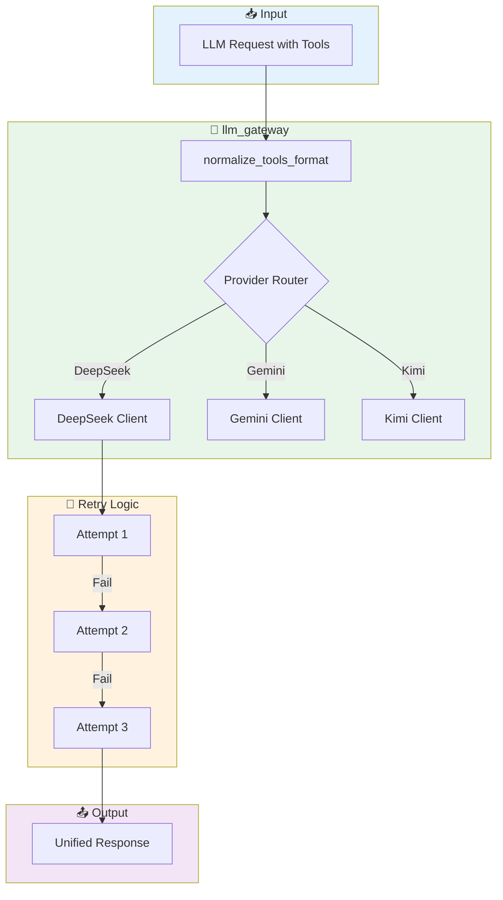
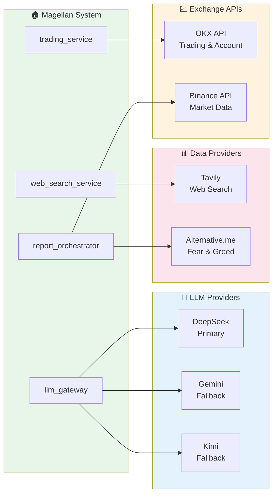

# System Architecture

This document provides a comprehensive overview of the Magellan Trading System architecture.

## Table of Contents
1. [Service Architecture](#service-architecture)
2. [Docker Topology](#docker-topology)
3. [Component Overview](#component-overview)
4. [Request Flow](#request-flow)
5. [External Integrations](#external-integrations)

---

## Service Architecture

### High-Level Overview



---

## Docker Topology

### Container Details



### Docker Compose Services

| Service | Port | Build Context | Purpose |
|---------|------|---------------|---------|
| `trading_service` | 8020 | `./trading-service` | Main entry point, scheduler, position monitoring |
| `report_orchestrator` | 8001 | `../backend/services/report_orchestrator` | Agent system, trading meeting orchestration |
| `llm_gateway` | 8000 | `../backend/services/llm_gateway` | LLM API abstraction (DeepSeek, Gemini, Kimi) |
| `web_search_service` | 8010 | `../backend/services/web_search_service` | Tavily search integration |
| `redis` | 6379 | `redis:7-alpine` | Memory, position, and prediction storage |

---

## Component Overview

### Core Components



### File Structure

```
trading-standalone/
├── trading-service/           # Main trading service
│   ├── app/
│   │   ├── main.py           # FastAPI app
│   │   ├── scheduler.py      # Trading scheduler
│   │   └── position_monitor.py
│   └── Dockerfile
│
├── ../backend/services/
│   ├── report_orchestrator/   # Agent system
│   │   ├── app/
│   │   │   ├── core/
│   │   │   │   ├── trading/
│   │   │   │   │   ├── trading_meeting.py    # 5-phase orchestration
│   │   │   │   │   ├── trading_tools.py      # Tool implementations
│   │   │   │   │   ├── position_context.py   # Position state
│   │   │   │   │   └── agent_memory.py       # Memory system
│   │   │   │   └── roundtable/
│   │   │   │       ├── agent.py             # Base agent class
│   │   │   │       └── tool.py              # Tool definitions
│   │   │   └── models/
│   │   │       └── trading_models.py        # Data models
│   │   └── Dockerfile
│   │
│   ├── llm_gateway/           # LLM abstraction
│   │   └── app/main.py        # Multi-provider LLM calls
│   │
│   └── web_search_service/    # Search service
│       └── app/main.py        # Tavily integration
│
└── docker-compose.yml         # Container orchestration
```

---

## Request Flow

### Trading Meeting Request Flow



### LLM Gateway Request Flow



---

## External Integrations

### API Connections



### Environment Variables

| Variable | Service | Description |
|----------|---------|-------------|
| `DEEPSEEK_API_KEY` | llm_gateway | DeepSeek API authentication |
| `DEEPSEEK_BASE_URL` | llm_gateway | DeepSeek API endpoint |
| `OKX_API_KEY` | trading_service | OKX trading API key |
| `OKX_SECRET_KEY` | trading_service | OKX API secret |
| `OKX_PASSPHRASE` | trading_service | OKX API passphrase |
| `OKX_DEMO_MODE` | trading_service | Enable demo trading |
| `TAVILY_API_KEY` | web_search_service | Tavily search API key |
| `SCHEDULER_INTERVAL_HOURS` | trading_service | Meeting trigger interval |
| `MAX_LEVERAGE` | report_orchestrator | Maximum allowed leverage |

---

## Related Documents

- [AGENT_DATA_FLOW.md](./AGENT_DATA_FLOW.md) - Agent-to-agent data flow
- [PHASE_DETAILS.md](./PHASE_DETAILS.md) - Detailed phase breakdown
- [TOOL_REFERENCE.md](./TOOL_REFERENCE.md) - Available tools

---

*Last Updated: 2024-12-09*
