# System Architecture

This document provides a comprehensive overview of the Magellan Trading System architecture.

## Table of Contents
1. [Service Architecture](#service-architecture)
2. [Docker Topology](#docker-topology)
3. [Component Overview](#component-overview)
4. [Request Flow](#request-flow)
5. [External Integrations](#external-integrations)

---

## Service Architecture

### High-Level Overview


---

## Docker Topology

### Container Details


### Docker Compose Services

| Service | Port | Build Context | Purpose |
|---------|------|---------------|---------|
| `trading_service` | 8020 | `./trading-service` | Main entry point, scheduler, position monitoring |
| `report_orchestrator` | 8001 | `../backend/services/report_orchestrator` | Agent system, trading meeting orchestration |
| `llm_gateway` | 8000 | `../backend/services/llm_gateway` | LLM API abstraction (DeepSeek, Gemini, Kimi) |
| `web_search_service` | 8010 | `../backend/services/web_search_service` | Tavily search integration |
| `redis` | 6379 | `redis:7-alpine` | Memory, position, and prediction storage |

---

## Component Overview

### Core Components


### File Structure

```
trading-standalone/
├── trading-service/           # Main trading service
│   ├── app/
│   │   ├── main.py           # FastAPI app
│   │   ├── scheduler.py      # Trading scheduler
│   │   └── position_monitor.py
│   └── Dockerfile
│
├── ../backend/services/
│   ├── report_orchestrator/   # Agent system
│   │   ├── app/
│   │   │   ├── core/
│   │   │   │   ├── trading/
│   │   │   │   │   ├── trading_meeting.py    # 5-phase orchestration
│   │   │   │   │   ├── trading_tools.py      # Tool implementations
│   │   │   │   │   ├── position_context.py   # Position state
│   │   │   │   │   └── agent_memory.py       # Memory system
│   │   │   │   └── roundtable/
│   │   │   │       ├── agent.py             # Base agent class
│   │   │   │       └── tool.py              # Tool definitions
│   │   │   └── models/
│   │   │       └── trading_models.py        # Data models
│   │   └── Dockerfile
│   │
│   ├── llm_gateway/           # LLM abstraction
│   │   └── app/main.py        # Multi-provider LLM calls
│   │
│   └── web_search_service/    # Search service
│       └── app/main.py        # Tavily integration
│
└── docker-compose.yml         # Container orchestration
```

---

## Request Flow

### Trading Meeting Request Flow


### LLM Gateway Request Flow

```mermaid
flowchart TB
    subgraph Input["📥 Input"]
        REQ[LLM Request with Tools]
    end
    
    subgraph Gateway["🧠 llm_gateway"]
        NORM[normalize_tools_format]
        ROUTE{Provider Router}
        DS_CLIENT[DeepSeek Client]
        GEMINI_CLIENT[Gemini Client]
        KIMI_CLIENT[Kimi Client]
    end
    
    subgraph Retry["🔄 Retry Logic"]
        R1[Attempt 1]
        R2[Attempt 2]
        R3[Attempt 3]
    end
    
    subgraph Output["📤 Output"]
        RESP[Unified Response]
    end
    
    REQ --> NORM
    NORM --> ROUTE
    ROUTE -->|DeepSeek| DS_CLIENT
    ROUTE -->|Gemini| GEMINI_CLIENT
    ROUTE -->|Kimi| KIMI_CLIENT
    
    DS_CLIENT --> R1
    R1 -->|Fail| R2
    R2 -->|Fail| R3
    R3 --> RESP
    
    style Input fill:#e3f2fd
    style Gateway fill:#e8f5e9
    style Retry fill:#fff3e0
    style Output fill:#f3e5f5
```



---

## External Integrations

### API Connections

```mermaid
flowchart LR
    subgraph System["🏠 Magellan System"]
        TS[trading_service]
        RO[report_orchestrator]
        LLM[llm_gateway]
        WS[web_search_service]
    end
    
    subgraph Exchange["💹 Exchange APIs"]
        OKX[OKX API<br/>Trading & Account]
        BIN[Binance API<br/>Market Data]
    end
    
    subgraph LLM_Providers["🤖 LLM Providers"]
        DS[DeepSeek<br/>Primary]
        GEMINI[Gemini<br/>Fallback]
        KIMI[Kimi<br/>Fallback]
    end
    
    subgraph Data["📊 Data Providers"]
        TAV[Tavily<br/>Web Search]
        ALT[Alternative.me<br/>Fear & Greed]
    end
    
    TS --> OKX
    RO --> BIN
    RO --> ALT
    LLM --> DS & GEMINI & KIMI
    WS --> TAV
    
    style System fill:#e8f5e9
    style Exchange fill:#fff3e0
    style LLM_Providers fill:#e3f2fd
    style Data fill:#fce4ec
```



### Environment Variables

| Variable | Service | Description |
|----------|---------|-------------|
| `DEEPSEEK_API_KEY` | llm_gateway | DeepSeek API authentication |
| `DEEPSEEK_BASE_URL` | llm_gateway | DeepSeek API endpoint |
| `OKX_API_KEY` | trading_service | OKX trading API key |
| `OKX_SECRET_KEY` | trading_service | OKX API secret |
| `OKX_PASSPHRASE` | trading_service | OKX API passphrase |
| `OKX_DEMO_MODE` | trading_service | Enable demo trading |
| `TAVILY_API_KEY` | web_search_service | Tavily search API key |
| `SCHEDULER_INTERVAL_HOURS` | trading_service | Meeting trigger interval |
| `MAX_LEVERAGE` | report_orchestrator | Maximum allowed leverage |

---

## Related Documents

- [AGENT_DATA_FLOW.md](./AGENT_DATA_FLOW.md) - Agent-to-agent data flow
- [PHASE_DETAILS.md](./PHASE_DETAILS.md) - Detailed phase breakdown
- [TOOL_REFERENCE.md](./TOOL_REFERENCE.md) - Available tools

---

*Last Updated: 2024-12-09*
