# Memory System

This document describes the agent memory and reflection system.

## Table of Contents
1. [Overview](#overview)
2. [Memory Flow](#memory-flow)
3. [Reflection Generation](#reflection-generation)
4. [Memory Storage](#memory-storage)

---

## Overview

The memory system enables agents to learn from past trades and improve decision-making over time.


### Key Components

| Component | Purpose | Storage |
|-----------|---------|---------|
| `AgentMemory` | Historical performance stats | Redis |
| `PredictionStore` | Trade predictions per agent | Redis |
| `ReflectionGenerator` | LLM-based reflection | In-memory |

---

## Memory Flow

### During Trading Meeting


### After Trade Opens


### After Position Closes


---

## Reflection Generation

### Prompt Structure

```markdown
You are {agent_name}, please reflect on this trade:

## Your Prediction at the Time
- Direction: {direction}
- Confidence: {confidence}%
- Key Reasoning: {reasoning}

## Actual Result
- Entry Price: ${entry_price}
- Exit Price: ${exit_price}
- P&L: ${pnl} ({pnl_percent}%)
- Holding Time: {holding_hours}h
- Close Reason: {tp/sl/manual}

## Please Reflect On:
1. Was your prediction correct? Why/Why not?
2. What analysis was accurate?
3. What did you miss or get wrong?
4. What lessons should you remember?
5. What would you do differently next time?

## Output Format (JSON):
{
  "summary": "Brief trade summary",
  "what_went_well": ["..."],
  "what_went_wrong": ["..."],
  "lessons_learned": ["..."],
  "next_time_action": "..."
}
```

### Reflection Output

```json
{
  "summary": "Correct long prediction, took profit successfully",
  "what_went_well": [
    "RSI oversold signal was accurate",
    "Entry timing was good",
    "TP hit before pullback"
  ],
  "what_went_wrong": [
    "Could have held longer for more profit",
    "SL was too tight"
  ],
  "lessons_learned": [
    "Trust RSI signals in ranging markets",
    "Consider trailing stop for trending moves"
  ],
  "next_time_action": "Use trailing stop when momentum is strong"
}
```

---

## Memory Storage

### Redis Key Structure

```
agent_memory:{agent_id}     -> AgentMemory JSON
predictions:{trade_id}      -> List[AgentPrediction]
reflections:{agent_id}      -> List[TradeReflection]
```

### Memory Update Flow

```mermaid
flowchart TB
    subgraph Input["📥 Reflection Input"]
        RF[TradeReflection]
        TR[TradeResult]
    end
    
    subgraph Update["🔄 Memory Update"]
        U1[Update trade count]
        U2[Update win/loss]
        U3[Update P&L stats]
        U4[Update streaks]
        U5[Add lessons]
        U6[Update focus]
        U1 --> U2 --> U3 --> U4 --> U5 --> U6
    end
    
    subgraph Output["📤 Updated Memory"]
        MEM[AgentMemory]
    end
    
    RF --> U1
    TR --> U1
    U6 --> MEM
```



### Statistics Updated

| Statistic | Calculation |
|-----------|-------------|
| `total_trades` | `+= 1` |
| `winning_trades` | `+= 1 if pnl > 0` |
| `losing_trades` | `+= 1 if pnl <= 0` |
| `total_pnl` | `+= trade_pnl` |
| `win_rate` | `winning_trades / total_trades` |
| `average_pnl` | `total_pnl / total_trades` |
| `best_trade_pnl` | `max(best_trade_pnl, trade_pnl)` |
| `worst_trade_pnl` | `min(worst_trade_pnl, trade_pnl)` |
| `consecutive_wins` | `+= 1 if win else reset to 0` |
| `consecutive_losses` | `+= 1 if loss else reset to 0` |

---

## Memory Context Injection

### Context Template

```markdown
## 📊 Last Trade Review
✅ Last trade: Long BTC, Profit $245.50 (+3.2%)
Lesson: Wait for confirmation before entry

## ⚠️ Current Focus
Be more cautious with high leverage in volatile markets

## 📝 Lessons You've Learned
- High confidence predictions can also be wrong
- Wait for clearer signals before committing
- Reduce position size in uncertain conditions

## 📈 Your Trading Performance
- Total Trades: 15
- Win Rate: 60.0%
- Total P&L: $1,234.56
- Average P&L: $82.30
- Current Win Streak: 2

## 🚫 Mistakes to Avoid
- Over-leveraging in sideways markets
- Ignoring macro economic data

## ✅ Your Strengths
- High overall win rate
- Positive average P&L per trade

## 🔧 Areas for Improvement
- Need better risk control for consecutive losses
```

---

## Related Documents

- [AGENT_DATA_FLOW.md](./AGENT_DATA_FLOW.md) - Data flow visualization
- [DATA_STRUCTURES.md](./DATA_STRUCTURES.md) - Data models
- [PHASE_DETAILS.md](./PHASE_DETAILS.md) - Phase information

---

*Last Updated: 2024-12-09*
