# Phase Details

This document provides detailed information about each phase of the trading decision process.

## Table of Contents
1. [Phase Overview](#phase-overview)
2. [Phase 1: Market Analysis](#phase-1-market-analysis)
3. [Phase 2: Signal Generation](#phase-2-signal-generation)
4. [Phase 3: Risk Assessment](#phase-3-risk-assessment)
5. [Phase 4: Consensus Building](#phase-4-consensus-building)
6. [Phase 5: Trade Execution](#phase-5-trade-execution)

---

## Phase Overview


| Phase | Agents | Purpose | Output |
|-------|--------|---------|--------|
| 1 | 4 Analysts | Gather and analyze market data | Analysis text |
| 2 | 4 Analysts | Generate trading votes | JSON votes |
| 3 | RiskAssessor | Evaluate trade risks | Risk assessment |
| 4 | Leader | Synthesize consensus | Meeting summary |
| 5 | TradeExecutor | Execute decision | Trade signal |

---

## Phase 1: Market Analysis

### Purpose
Each analyst agent uses their specialized tools to gather and analyze market data from their unique perspective.

### Agents Active
- **TechnicalAnalyst** - Price action, indicators, patterns
- **MacroEconomist** - Economic factors, policy, news
- **SentimentAnalyst** - Market sentiment, fear/greed
- **QuantStrategist** - Statistical analysis, metrics

### Input Context

```mermaid
flowchart TB
    subgraph Input["Agent Receives"]
        SP[System Prompt<br/>"You are a Technical Analyst..."]
        MC[Memory Context<br/>Win rate: 60%, Last trade: +$245]
        PC[Position Context<br/>Currently holding: LONG 5x]
        AP[Analysis Prompt<br/>"Analyze current BTC market"]
    end
    
    subgraph Process["Agent Process"]
        TC[Tool Calls]
        AN[Analysis]
    end
    
    Input --> TC --> AN
```

### Tool Usage by Agent

| Agent | Tools | Data Retrieved |
|-------|-------|----------------|
| TechnicalAnalyst | `get_market_price`, `get_technical_indicators`, `get_funding_rate` | Price, RSI, MACD, BBands, funding |
| MacroEconomist | `tavily_search` | Fed policy, ETF flows, regulations |
| SentimentAnalyst | `get_fear_greed_index` | Fear & Greed Index value |
| QuantStrategist | `get_technical_indicators` | Statistical metrics, volatility |

### Output
Each agent produces a detailed market analysis text in natural language.

---

## Phase 2: Signal Generation

### Purpose
Each analyst converts their analysis into a structured trading vote with specific parameters.

### Input
- Phase 1 analysis history
- Position context
- Decision options matrix

### Vote JSON Structure

```json
{
  "direction": "long | short | hold",
  "confidence": 0-100,
  "leverage": 1-20,
  "take_profit_percent": 1.0-50.0,
  "stop_loss_percent": 0.5-20.0,
  "reasoning": "Brief explanation with data references"
}
```

### Direction Options

| Current Position | Available Directions |
|------------------|---------------------|
| No position | `long`, `short`, `hold` |
| Has LONG | `close`, `hold`, `add_long`, `reverse` |
| Has SHORT | `close`, `hold`, `add_short`, `reverse` |

### Vote Parsing Flow


---

## Phase 3: Risk Assessment

### Purpose
RiskAssessor evaluates the proposed trade from a risk management perspective.

### Input


### Risk Evaluation Points

**No Position:**
1. Is entry direction well-justified?
2. Does leverage match confidence level?
3. Are TP/SL settings reasonable?
4. Does position size comply with limits?
5. Is market volatility suitable?

**Has Position:**
1. Distance to liquidation
2. Current P&L status
3. Expert recommendation vs position direction
4. TP/SL proximity warnings

### Risk Warnings

| Level | Trigger | Action |
|-------|---------|--------|
| 🟢 Safe | >15% from liquidation | Normal trading |
| 🟡 Warning | 10-15% from liquidation | Reduce position size |
| 🔴 Danger | <10% from liquidation | Close position |

---

## Phase 4: Consensus Building

### Purpose
Leader synthesizes all expert opinions and risk assessment into a coherent recommendation.

### Input
- Full conversation history (all phases)
- Position context  
- Decision guidance matrix

### Decision Guidance Matrix

```mermaid
flowchart TB
    subgraph Current["Current Position: LONG"]
        POS[+$245 profit]
    end
    
    subgraph Votes["Expert Consensus"]
        V1[Majority Long] -->|🟢 Same| R1[Maintain or Add]
        V2[Majority Short] -->|🔴 Opposite| R2[Close or Reverse]
        V3[Split Opinions] -->|⚪ Unclear| R3[Consider Closing]
        V4[Unanimous Hold] -->|⚪ Neutral| R4[Hold, Tighter SL]
    end
```



### Output
Natural language meeting summary including:
- Expert consensus count
- Key agreement/disagreement points
- Risk assessment conclusions
- Strategy recommendation
- Confidence level

---

## Phase 5: Trade Execution

### Purpose
TradeExecutor makes the final trading decision via tool calling.

### Input
- Vote results summary
- Current position status
- Leader's meeting summary

### Decision Logic


### Available Tools

| Tool | Parameters | Purpose |
|------|------------|---------|
| `open_long` | leverage, amount_usdt, tp_percent, sl_percent | Open long position |
| `open_short` | leverage, amount_usdt, tp_percent, sl_percent | Open short position |
| `close_position` | symbol | Close current position |
| `hold` | reason | Do nothing, wait |

### Parameter Calculation

**Leverage:**
```
High consensus (4-5 votes): max_leverage × 0.6
Moderate (3 votes):         max_leverage × 0.4
Weak (2 votes):             max_leverage × 0.25
```

**Position Size:**
```
High confidence (≥80%): max_position_percent
Moderate (60-79%):      (min + max) / 2
Low (<60%):             min_position_percent
```

---

## Phase Timing

Typical execution time per phase:

| Phase | Duration | Notes |
|-------|----------|-------|
| Phase 1 | 60-120s | 4 agents × tools + LLM |
| Phase 2 | 30-60s | 4 agents × vote generation |
| Phase 3 | 15-30s | 1 agent evaluation |
| Phase 4 | 20-40s | 1 agent synthesis |
| Phase 5 | 10-20s | 1 agent + tool execution |
| **Total** | **~3-5 min** | Full trading meeting |

---

## Related Documents

- [AGENT_DATA_FLOW.md](./AGENT_DATA_FLOW.md) - Data flow visualization
- [ARCHITECTURE.md](./ARCHITECTURE.md) - System architecture
- [DATA_STRUCTURES.md](./DATA_STRUCTURES.md) - Data models

---

*Last Updated: 2024-12-09*
