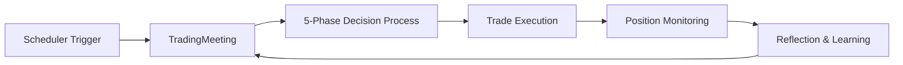

# Trading System Documentation

This directory contains comprehensive documentation for the Magellan Trading System's agent-based architecture.

## Documentation Structure

| Document | Description |
|----------|-------------|
| [ARCHITECTURE.md](./ARCHITECTURE.md) | System architecture, Docker services, and component overview |
| [AGENT_DATA_FLOW.md](./AGENT_DATA_FLOW.md) | **Agent-to-Agent data flow visualization** with Mermaid diagrams |
| [PHASE_DETAILS.md](./PHASE_DETAILS.md) | Detailed breakdown of the 5 trading phases |
| [DATA_STRUCTURES.md](./DATA_STRUCTURES.md) | Core data models and structures |
| [MEMORY_SYSTEM.md](./MEMORY_SYSTEM.md) | Agent memory and reflection system |
| [TOOL_REFERENCE.md](./TOOL_REFERENCE.md) | Available tools and their usage |

## Quick Start

## Key Concepts

### Agent Roundtable
The system uses a multi-agent roundtable approach where 6 specialized agents collaborate to make trading decisions:

- **4 Analysts** (TechnicalAnalyst, MacroEconomist, SentimentAnalyst, QuantStrategist)
- **1 Risk Assessor** (RiskAssessor)
- **1 Leader** (Leader/Moderator)
- **1 Executor** (TradeExecutor)

### 5-Phase Decision Process
1. **Market Analysis** - Each analyst gathers and analyzes market data
2. **Signal Generation** - Each analyst votes with direction, confidence, and parameters
3. **Risk Assessment** - RiskAssessor evaluates the proposed trade
4. **Consensus Building** - Leader synthesizes all opinions
5. **Trade Execution** - TradeExecutor makes the final decision via tool calling

### Data Flow
See [AGENT_DATA_FLOW.md](./AGENT_DATA_FLOW.md) for detailed visualization of how data flows between agents.

---

*Last Updated: 2024-12-09*
