# Tool Reference

This document provides a complete reference for all tools available to trading agents.

## Table of Contents
1. [Tool Categories](#tool-categories)
2. [Market Data Tools](#market-data-tools)
3. [Analysis Tools](#analysis-tools)
4. [Trading Execution Tools](#trading-execution-tools)
5. [Tool Calling Formats](#tool-calling-formats)

---

## Tool Categories

```mermaid
flowchart TB
    subgraph Market["📊 Market Data"]
        M1[get_market_price]
        M2[get_klines]
    end
    
    subgraph Analysis["📈 Analysis"]
        A1[calculate_technical_indicators]
        A2[get_fear_greed_index]
        A3[get_funding_rate]
        A4[tavily_search]
    end
    
    subgraph Account["💰 Account"]
        AC1[get_account_balance]
        AC2[get_current_position]
        AC3[get_trade_history]
    end
    
    subgraph Execution["🎯 Execution"]
        E1[open_long]
        E2[open_short]
        E3[close_position]
        E4[hold]
    end
```



### Tool Access by Agent

| Agent | Market | Analysis | Account | Execution |
|-------|--------|----------|---------|-----------|
| TechnicalAnalyst | ✅ | ✅ | ✅ | ❌ |
| MacroEconomist | ✅ | ✅ | ✅ | ❌ |
| SentimentAnalyst | ✅ | ✅ | ✅ | ❌ |
| QuantStrategist | ✅ | ✅ | ✅ | ❌ |
| RiskAssessor | ❌ | ❌ | ✅ | ❌ |
| Leader | ❌ | ❌ | ❌ | ❌ |
| TradeExecutor | ✅ | ✅ | ✅ | ✅ |

---

## Market Data Tools

### get_market_price

Get current market price and 24h data.

```json
{
  "name": "get_market_price",
  "parameters": {
    "symbol": {
      "type": "string",
      "default": "BTC-USDT-SWAP"
    }
  }
}
```

**Output:**
```json
{
  "symbol": "BTC-USDT-SWAP",
  "price": 98500.50,
  "change_24h": "+2.35%",
  "volume_24h": "$45,678,901,234",
  "high_24h": 99200.00,
  "low_24h": 96100.00,
  "timestamp": "2024-12-09T10:30:00Z",
  "source": "Binance API (REAL DATA)"
}
```

---

### get_klines

Get K-line/candlestick data.

```json
{
  "name": "get_klines",
  "parameters": {
    "symbol": { "type": "string", "default": "BTC-USDT-SWAP" },
    "timeframe": { "type": "string", "default": "4h", "enum": ["1m", "5m", "15m", "1h", "4h", "1d"] },
    "limit": { "type": "integer", "default": 100 }
  }
}
```

**Output:**
```json
{
  "symbol": "BTC-USDT-SWAP",
  "timeframe": "4h",
  "count": 100,
  "latest_candle": {
    "open": 98200.00,
    "high": 98800.00,
    "low": 98000.00,
    "close": 98500.00,
    "volume": 1234.56
  },
  "price_range": {
    "high": 99200.00,
    "low": 95500.00
  },
  "trend": "uptrend",
  "change_pct": "+3.15%",
  "source": "Binance API (REAL DATA)"
}
```

---

## Analysis Tools

### calculate_technical_indicators

Calculate RSI, MACD, Bollinger Bands, EMA.

```json
{
  "name": "calculate_technical_indicators",
  "parameters": {
    "symbol": { "type": "string", "default": "BTC-USDT-SWAP" },
    "timeframe": { "type": "string", "default": "4h" }
  }
}
```

**Output:**
```json
{
  "symbol": "BTC-USDT-SWAP",
  "timeframe": "4h",
  "current_price": 98500.00,
  "rsi_14": 55.23,
  "rsi_signal": "neutral",
  "macd": {
    "macd": 245.50,
    "signal": 198.30,
    "histogram": 47.20,
    "trend": "bullish"
  },
  "ema": {
    "ema_20": 97800.00,
    "ema_50": 96500.00,
    "trend": "uptrend"
  },
  "bollinger_bands": {
    "upper": 101500.00,
    "middle": 98000.00,
    "lower": 94500.00,
    "position": "middle zone"
  },
  "source": "Calculated from Binance REAL DATA"
}
```

---

### get_fear_greed_index

Get crypto market sentiment index.

```json
{
  "name": "get_fear_greed_index",
  "parameters": {}
}
```

**Output:**
```json
{
  "value": 65,
  "classification": "Greed",
  "timestamp": "2024-12-09T10:30:00Z",
  "interpretation": "Current market sentiment is Greed, index value 65/100",
  "source": "Alternative.me API (REAL DATA)"
}
```

---

### get_funding_rate

Get perpetual futures funding rate.

```json
{
  "name": "get_funding_rate",
  "parameters": {
    "symbol": { "type": "string", "default": "BTC-USDT-SWAP" }
  }
}
```

**Output:**
```json
{
  "symbol": "BTC-USDT-SWAP",
  "funding_rate": "0.0100%",
  "funding_rate_value": 0.0001,
  "next_funding_time": "in 4h 30m",
  "interpretation": "Positive funding rate (0.0100%), longs pay shorts, market bullish",
  "source": "Binance Futures API (REAL DATA)"
}
```

---

### tavily_search

Search for crypto news and market information.

```json
{
  "name": "tavily_search",
  "parameters": {
    "query": { "type": "string", "required": true },
    "max_results": { "type": "integer", "default": 5 },
    "time_range": { "type": "string", "enum": ["day", "week", "month"] },
    "topic": { "type": "string", "enum": ["general", "news"], "default": "general" }
  }
}
```

**Output:**
```json
{
  "success": true,
  "query": "BTC ETF inflows December 2024",
  "answer": "Bitcoin ETFs have seen strong inflows...",
  "results": [
    {
      "title": "Bitcoin ETF Sees Record Inflows",
      "url": "https://example.com/article",
      "content": "The Bitcoin ETF...",
      "score": 0.95
    }
  ],
  "result_count": 5,
  "source": "MCP Web Search"
}
```

---

## Account Tools

### get_account_balance

Get account balance and margin info.

```json
{
  "name": "get_account_balance",
  "parameters": {}
}
```

**Output:**
```json
{
  "⚠️ USE THIS VALUE FOR OPENING POSITIONS": "↓ true_available_margin ↓",
  "true_available_margin": "$8,500.00",
  "note": "True available = Total equity - Used margin",
  "total_equity": "$10,500.00",
  "available_balance": "$8,500.00",
  "used_margin": "$2,000.00",
  "unrealized_pnl": "$245.50",
  "realized_pnl": "$1,234.56",
  "win_rate": "65.0%",
  "total_trades": 15,
  "currency": "USDT"
}
```

---

### get_current_position

Get current open position details.

```json
{
  "name": "get_current_position",
  "parameters": {
    "symbol": { "type": "string", "default": "BTC-USDT-SWAP" }
  }
}
```

**Output (has position):**
```json
{
  "has_position": true,
  "symbol": "BTC-USDT-SWAP",
  "direction": "long",
  "size": 0.05,
  "entry_price": 98000.00,
  "current_price": 98500.00,
  "leverage": "5x",
  "unrealized_pnl": "$25.00",
  "unrealized_pnl_percent": "2.55%",
  "take_profit": 103000.00,
  "stop_loss": 96000.00,
  "liquidation_price": 82000.00
}
```

**Output (no position):**
```json
{
  "has_position": false,
  "message": "No current position"
}
```

---

## Trading Execution Tools

### open_long

Open a long (buy) position.

```json
{
  "name": "open_long",
  "parameters": {
    "symbol": { "type": "string", "default": "BTC-USDT-SWAP" },
    "leverage": { "type": "integer", "required": true, "minimum": 1, "maximum": 20 },
    "amount_usdt": { "type": "number", "required": true },
    "tp_percent": { "type": "number", "required": true, "minimum": 0.5, "maximum": 50 },
    "sl_percent": { "type": "number", "required": true, "minimum": 0.5, "maximum": 20 },
    "reason": { "type": "string" }
  }
}
```

**Output:**
```json
{
  "success": true,
  "trade_id": "trade_abc123",
  "direction": "long",
  "leverage": "5x",
  "amount": "$2,000.00",
  "entry_price": 98500.00,
  "take_profit": 103425.00,
  "stop_loss": 96530.00,
  "message": "Position opened successfully"
}
```

---

### open_short

Open a short (sell) position.

```json
{
  "name": "open_short",
  "parameters": {
    "symbol": { "type": "string", "default": "BTC-USDT-SWAP" },
    "leverage": { "type": "integer", "required": true },
    "amount_usdt": { "type": "number", "required": true },
    "tp_percent": { "type": "number", "required": true },
    "sl_percent": { "type": "number", "required": true },
    "reason": { "type": "string" }
  }
}
```

---

### close_position

Close current position.

```json
{
  "name": "close_position",
  "parameters": {
    "symbol": { "type": "string", "default": "BTC-USDT-SWAP" }
  }
}
```

**Output:**
```json
{
  "success": true,
  "closed_price": 99000.00,
  "pnl": 250.00,
  "pnl_percent": 2.55,
  "reason": "manual",
  "message": "Position closed successfully"
}
```

---

### hold

Decide to wait / no action.

```json
{
  "name": "hold",
  "parameters": {
    "reason": { "type": "string", "required": true }
  }
}
```

**Output:**
```json
{
  "success": true,
  "action": "hold",
  "reason": "Market signals unclear, waiting for confirmation",
  "message": "Decision: Hold - Market signals unclear"
}
```

---

## Tool Calling Formats

### OpenAI Native Format

```json
{
  "tool_calls": [{
    "id": "call_abc123",
    "type": "function",
    "function": {
      "name": "get_market_price",
      "arguments": "{\"symbol\": \"BTC-USDT-SWAP\"}"
    }
  }]
}
```

### Legacy Text Format

```
[USE_TOOL: open_long(leverage=5, amount_usdt=2000, tp_percent=5, sl_percent=2)]
```

---

## Related Documents

- [AGENT_DATA_FLOW.md](./AGENT_DATA_FLOW.md) - Data flow visualization
- [PHASE_DETAILS.md](./PHASE_DETAILS.md) - Phase information
- [ARCHITECTURE.md](./ARCHITECTURE.md) - System architecture

---

*Last Updated: 2024-12-09*
